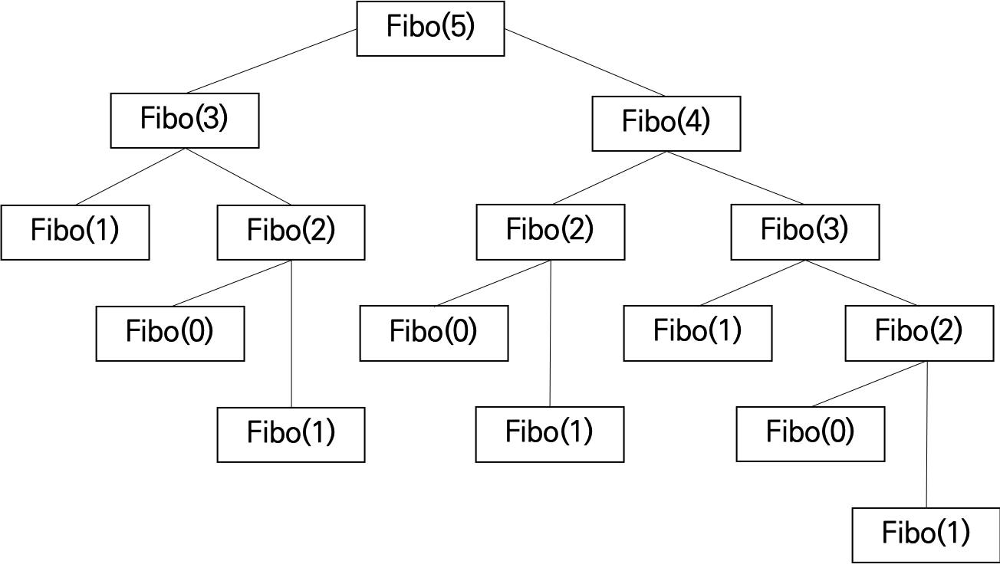
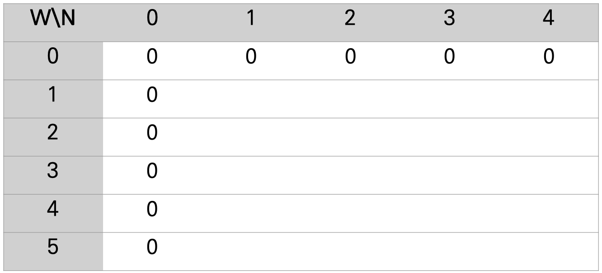
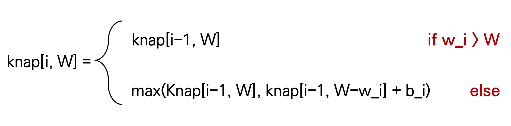
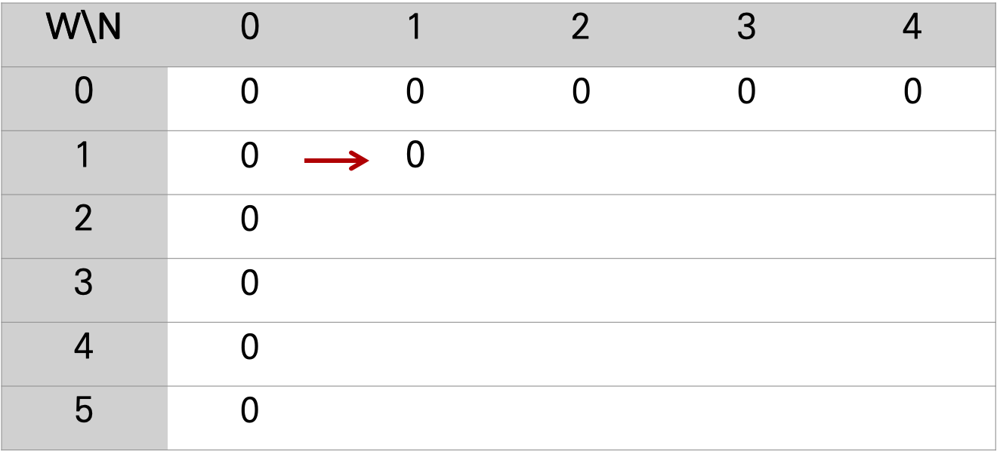
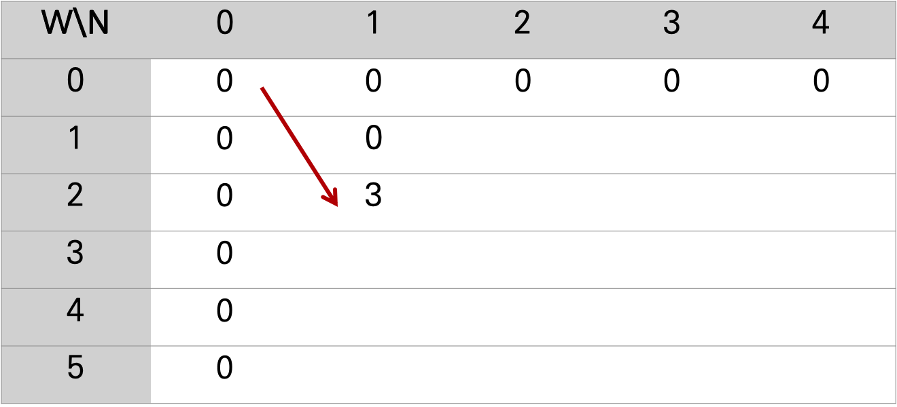
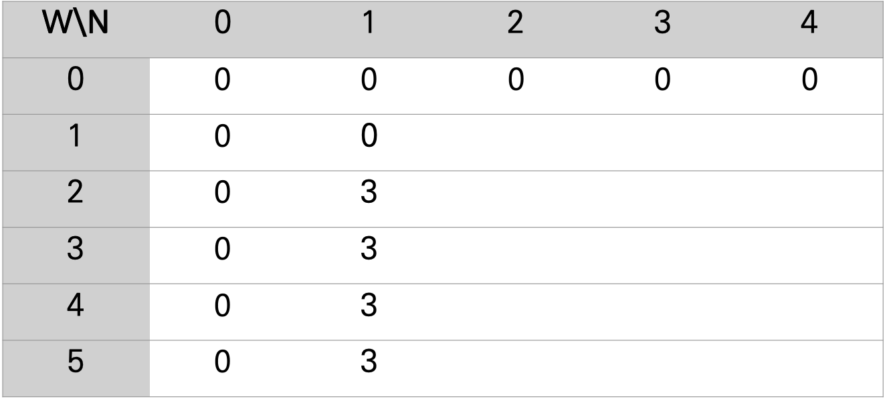
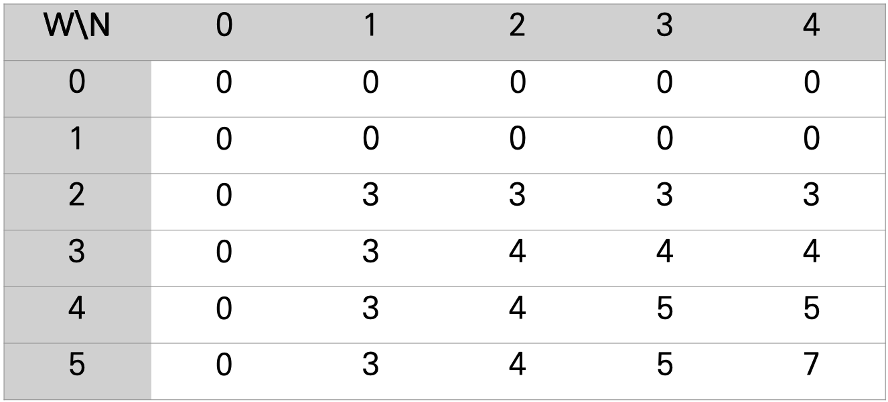
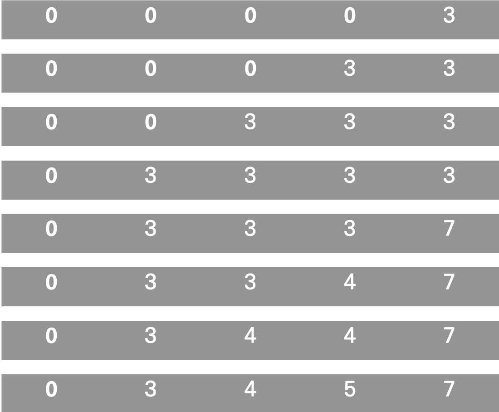

# Dynamic Programming (동적 계획법)
- [Knapsack](#Knapsack)
- [LCS(Longest Common Subsequence)](#LCS)
- [LIS(Longest Increasing Subsequence)](#LIS)
- [Edit Distance(편집거리)](#Edit-Distance)
- [Matrix Chain Multiplication(행렬곱)](#Matrix-Chain-Multiplication)


## DP란?
Dynamic Programming(동적 계획법)이란, 하나의 문제를 여러개의 작은 문제들로 나눠서 푸는 기법이다. 이 때 각각의 문제들은 sub-problem이라고 불리고, 항상 최적(optimal)한 해결책을 가지고 있어야 한다. Sub-problem의 최적화된 해결책을 가지고 더 큰 문제를 해결한다.

DP로 풀어서 속도를 확연하게 향상시킬 수 있는 문제가 바로 피보나치 수열 문제이다. 

<br/>

Fibo(N) = Fibo(n-1)+Fibo(n-2) (단, Fibo(0)=1, Fibo(1) = 1)

<br/>

피보나치 수열을 처음 배울 때 보통 재귀(recursion)으로 푸는 방법을 배운다. 종료 조건인 Fibo가 0일 때와 1일 때를 설정해놓고, 그 이외의 숫자가 들어올 때는 재귀적으로 자기 함수를 다시 부르도록 구현을 한다. 재귀함수를 보면 모든 조건들이 깔끔하게 눈에 들어오기 때문에 구현하는 것이 상대적으로 쉽다.

```python
def fibo(n):
    if n == 0:
        return 1
    if n == 1:
        return 1
    return fibo(n-1) + fibo(n-2)
```

하지만, 재귀로 피보나치 수열을 풀게 되면 밑의 그림과 같이 중복된 연산을 반복하게 된다. 예를 들어, Fibo(3)은 2번 계산되고, Fibo(2)는 3번 계산된다. 값은 항상 동일하기 떄문에 연산을 반복하는 것은 불필요하고 많은 시간을 잡아먹게 된다. 

<div align="center">

</div>


**그래서, DP를 사용해야 한다.**

DP를 사용하면 한번 구해놓은 값은 다시 구하지 않고 기존에 있는 저장된 값을 가져오게 된다. 이를 `Memoization`이라고 부른다. 불필요한 연산이 줄기 때문에 속도가 매우 향상된다. 

```python
# fibo(5)를 찾는다고 가정
fibo = [0 for _ in range(5)]
fibo[0] = 1
fibo[1] = 1

for i in range(2,5):
    fibo[i] = fibo[i-1] + fibo[i-2]
```
 

DP로 푼 피보나치 수열 문제는 전형적인 **Bottom-Up 방식**으로 푼 문제이다. Bottom-Up 방식이 무엇인지 이해하기 전에 반대되는 Top-Down 방식부터 이해하고 오자. ****

문제를 푸는 방식 중에 Top-Down, Bottom-Up 방식이 있다. 피보나치 수열 문제를 재귀로 풀었을 때는 Top-Down 방식을 사용했다. Top-Down 큰 문제를 작은 sub-problem들로 풀어나가는 것이다. 재귀로 푼 해결책을 보면, Fibo(5)를 Fibo(4)와 Fibo(3)으로 쪼개서 계산하고 그 밑 값들도 비슷하게 진행한다.

반면에 DP의 Bottom-Up은 작은 문제들을 먼저 풀어서 큰 문제에 다가가는 것이다. 문제를 해결한 코드를 보면, fibo[0], fibo[1]값을 먼저 지정해주고 2부터 시작해서 n까지 서서히 답을 구하게 된다. 모든 sub-problem들에 대한 해결책을 저장하기 때문에 이 방법은 메모리를 더 많이 차지하게 된다.

### **그렇다면 항상 Bottom-Up 방식이 빠른가?**

답부터 말하자면 아니다. Bottom-Up 방식이 피보나치 수열 문제에서는 재귀보다 빨랐지만, 모든 상황에서 빠른 것은 아니다. Bottom-Up 방식은 큰 문제까지 모든 sup-problem들을 계산해야 한다, 하지만 어떤 문제에서는 모든 sub-problem에 대한 해결책이 필요없을 수도 있다. Top-Down은 그 때 그 떄 필요한 sub-problem들만 호출해서 해결하기 때문에, 이러한 유형의 문제에서는 Top-Down 방식이 더 빠를 수도 있다. 

<br/>

## Knapsack

Knapsack(배낭) 문제는 DP의 대표적인 문제 유형 중 하나이다. 문제는 다음과 같다:

배낭이 있고 배낭에 담을 수 있는 최대 무게가 주어진다. 배낭에 담을 수 있는 물품들도 주어지는 데 각각 무게와 benefit(가치)가 다르다. 이 문제의 목표는 **배낭에 담을 수 있을 만큼 물품들을 넣었을 때 benefit(가치)가 최대가 되는 짐을 고르는 것**이다. 단, 물품들은 쪼갤 수 없다고 가정한다. 그래서 이 문제는 `0-1 knapsack problem`이라고도 부른다. 

(물품들을 쪼갤 수 있다고 가정해서 푸는 knapsack문제는 `fractional knapsack problem`이라고 부른다. 밑에서 설명할 예정이다.)

이제 예제 문제를 보면서 DP로 이 문제를 어떻게 해결 할 수 있는지 살펴보려고 한다:

- 배낭의 최대 무게는 5
- (무게, 가치) 형태의 물품 4개
    1. (2, 3)
    2. (3, 4)
    3. (4, 5)
    4. (5, 6)

배낭의 최대 무게를 넘지 않는 선에서 최대 가치를 줄 수 있는 물품들을 적절히 선택해야 한다. DP를 사용하면 문제를 sub-problem들로 나누고 그 안에서 각 sub-problem들에 대한 최적의 답을 저장해야 한다. 

값들을 저장하기 위해 일반적으로 **2D array를** 만들어서 문제를 푼다. **W는 배낭의 최대 무게**이고 **N은 물품의 index**이다. W - 2, N -2는 내가 담을 수 있는 무게가 총 2이고, 1번과 2번 물품들 중에서만 고르겠다는 의미이다. 초기에 최대 무게가 0이 던지, 내가 고를 수 있는 물품이 0개이면 아무 benefit(가치)도 얻을 수 없기 때문에 다 0으로 행과 열을 초기화 한다.

<div align="center">

</div>

이제 2D array를 하나씩 채우면서 배낭 무게 5일 때 최대 가치를 구하려고 한다. W-5, N-4에 오는 값이 답이 될 것이다. 이 array를 풀어나가려면 밑의 조건을 따라가면 된다.

<div align="center">

</div>

위에 식은, 내가 넣을 수 있는 물품이 있는데, 그 물품을 배낭에 넣었을 때 최대 무게를 초과한다면 benefit(가치)를 추가하지 않고 이전 benefit(가치)를 그대로 가져오겠다는 것이다. 밑에 식은, 나에게 새로운 물품이 있고 최대 무게를 넘어서지 않는다는 것이다. 이제 이전 benefit(가치)와 이전 것의 물품을 빼고 내가 새로 받은 물품의 가치를 넣었을 때의 가치를 비교해서 더 큰 것을 취한다. 

글로만 설명을 읽으면 헷갈리기 쉬우니 array를 채우면서 이해해보자.

W-1, N-1 일 때, (2,3) 인 물품을 넣을 수 있게 된다. 나에게 주어진 최대 무게는 1이지만, 내가 가지고 있는 물품의 무게는 2이기 떄문에 해당 물품을 넣을 수 없게 된다. 그렇기 때문에 이전 benefit(가치)를 그대로 가져와서 0이 되는 것이다.

<div align="center">

</div>

W-2, N-1일 때 나에게 있는 (2,3) 물품을 넣을 수 있게 되기 때문에 물품을 넣고 3이라는 benefit(가치)를 얻게 된다.

<div align="center">

</div>

W가 늘어도 N-1로 고정되어있을 때 그 밑의 값들은 변하지 않고 3의 benefit(가치)를 갖게 된다. 이는 나에게 새로운 물품이 주어지지 않고 최대 허용가능한 무게만 늘었기 때문이다. 최대로 넣을 수 있는 물품의 무게가 늘어도 새로운 물품이 없으면 benefit(가치)를 향상시킬 수 없다.

<div align="center">

</div>

이러한 조건을 따라서 2D array를 채우다보면 밑과 같은 결과를 얻게 된다. W-4, N-4일 때 (2,3), (3,4), (4,5), (5,6) 물품들을 가지고 있고 무게 4에서 최대로 얻을 수 있는 benefit(가치)는 5이다. 하지만, W-5로 변할 때 (5,6)에서 benefit(가치)가 6이 되는 것이 아니라, (2,3), (3,4) 물품들을 선택해서 7의 benefit(가치)를 얻게 된다. knap[i-1, W-w_i] + b_i 가 더 크기 때문에 값이 바뀌게 된 것이다. 

<div align="center">

</div>

### 0-1 Knapsack 문제, Python풀이

```python
N, W = 4, 5
w = [2, 3, 4, 5]
b = [3, 4, 5, 6]

knap = [[0 for _ in range(W+1)] for _ in range(N+1)]

for i in range(N+1):
    for j in range(W+1):
        if w[i-1] <= j: 
            knap[i][j] = max(b[i-1] + knap[i-1][j-w[i-1]],  knap[i-1][j]) 
        else: 
            knap[i][j] = knap[i-1][j] 

print(knap)
```

## 1-D array로 0-1 knapsack 문제 풀기

위에서는 2D array로 배낭 문제를 해결했지만, 사실 이 문제를 1D array로도 풀 수 있다. 2D array로 문제를 풀면 각 칸이 무엇을 의미하는지 보다 직관적으로 알 수 있지만, N과 W의 크기가 커지면 메모리도 많이 차지하게 되는 단점이 있다. 1D array로 문제를 풀면 (2D-array 크기)/ N 만큼의 메모리만 사용하면 된다. 

```python
N, W = 4, 5
bag = [(2,3), (3,4), (4,5), (5,6)] # (weight,benefit) 순서

knap = [0 for _ in range(W+1)]

for i in range(N):
    for j in range(W, 1, -1):
        if bag[i][0] <= j:
            knap[j] = max(knap[j], knap[j-bag[i][0]] + bag[i][1])

print(knap)
```

위 알고리즘을 실행시키면 밑의 그림처럼 진행이 된다. 

- i = 0, j = 5

    : bag[i][0] 는 2이고 5보다 작기 때문에 if 구문이 실행된다. knap[j] 는 0이고 knap[j-bag[i][0]]도 0이고 bag[i][1]은 3이다. max 함수에 의해서 knap[j-bag[i][0]]+bag[i][1]의 값이 knap[j]에 저장이 되는 것이다.

- i = 0, j = 4

    : 위와 같은 조건으로 if 구문이 실행된다. kna[j] 는 0이고 knap[j-bag[i][0]]도 0이고, bag[i][1]은 3이기 때문에 더 큰 값을 저장하는 것이다.

...

- i = 1, j = 5

    : 그림에서 5 번째 줄에 해당하는 내용이다. bag[i][0]는 3이고 j보다 작기에 if 구문이 실행된다. knap[j]는 3이고, knap[j-bag[i][0]]도 3이고 bag[i][1]은 4이다. 3 < 3+ 4 이기 때문에 7이 저장이 된다.

...

<div align="center">

</div>

knap[j-bag[i][0]]이 무슨 일을 하는지 알면 이해하는 것이 더 쉬워진다. 기존의 index에서 새로 들어온 물품의 무게를 빼는 것이다. 그렇게 해서 나온 index는 새로 들어온 물품과 함께 선택할 수 있는 물품의 무게가 되는 것이다. 그렇다는 것은 해당 index의 값은 기존 물품의 benefit(가치)이고 그 값에 새로운 물품의 benefit(가치)를 더하면 새로운 benefit(가치)를 구할 수 있게 되는 것이다. 

# Knapsack - fractional (Greedy)

지금까지는 물품들을 쪼갤 수 없다고 가정했기 때문에 DP를 사용해서만 문제를 풀 수 있었다.  Fractional knapsack 문제는 물품들을 쪼갤 수 있다고 가정하기 때문에 **Greedy 알고리즘으로** 풀 수 있다. 기본 아이디어는 다음과 같다:

- benefit(가치) / weight(무게) 의 비율을 각 물품마다 구한다
- 비율이 높은 순으로 정렬을 한다
- 배낭에 물품들을 비율 높은 순으로 넣는다.
    - 만약에, 물품의 무게가 무게 최대치보다 크다면
        - (물품의 비율) * (최대치까지 남은 무게)를 구해서 답에 더해준다
    - 아니라면,
        - 물품을 그대로 배낭에 넣고, 배낭에 넣을 수 있는 최대치 무게 값 들어간 무게만큼 줄인다.

```python
N, W = 4, 5
w = [2, 3, 4, 5]
b = [3, 4, 5, 6]
ratio = [[0, 0] for _ in range(N)] # 왼쪽은 ratio값, 오른쪽은 index를 저장한다

for i in range(N):
    ratio[i][0] = b[i]/w[i]
    ratio[i][1] = i 

ans = 0
for r in sorted(ratio, key=lambda x:-x[0]):
    if w[r[1]] <= W:
        W -= w[r[1]]
        ans += b[r[1]]
    else:
        ans += (W * r[0])
        break
print(ans)
```

이처럼 물품을 쪼갤 수 있는 상황이면 배낭을 가득 채울 수 있고 가장 높은 benefit(가치)를 지닌 배낭을 만들 수 있게 된다.

<br/>

## LCS

## LIS

## Edit Distance

## Matrix Chain Multiplication