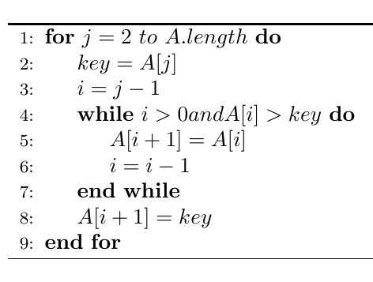
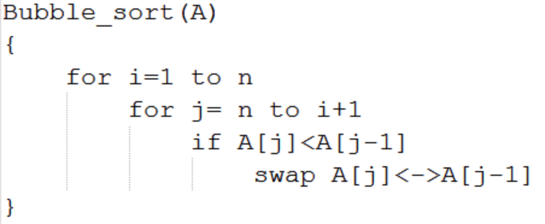
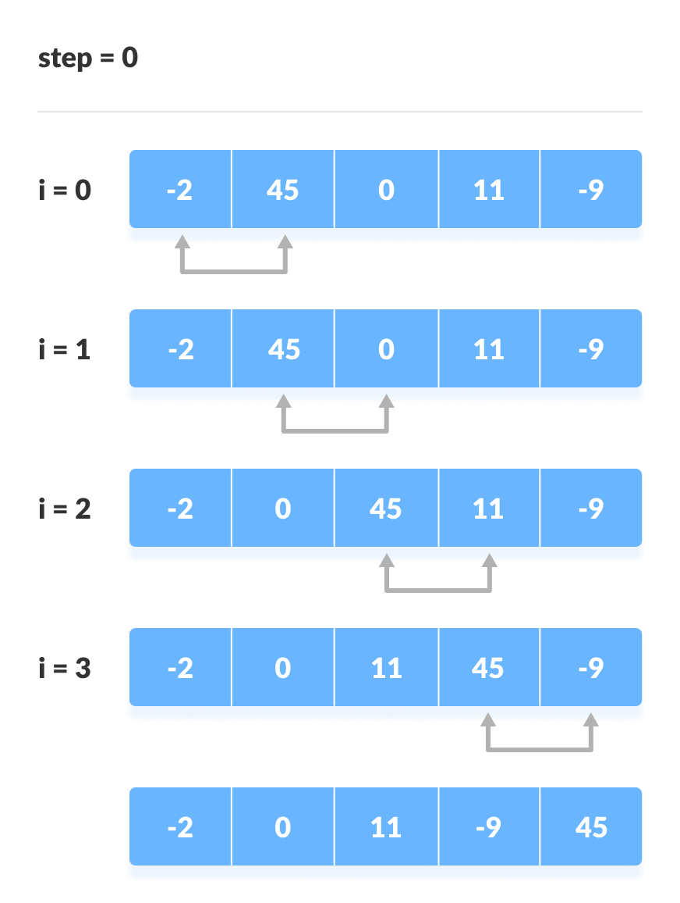
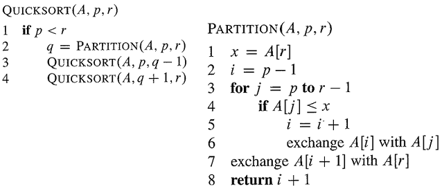
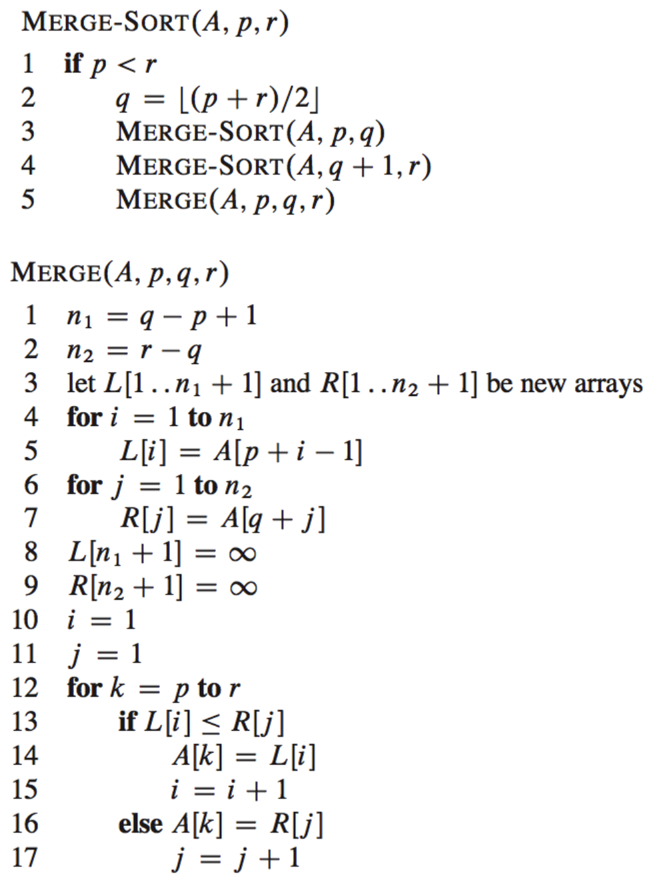
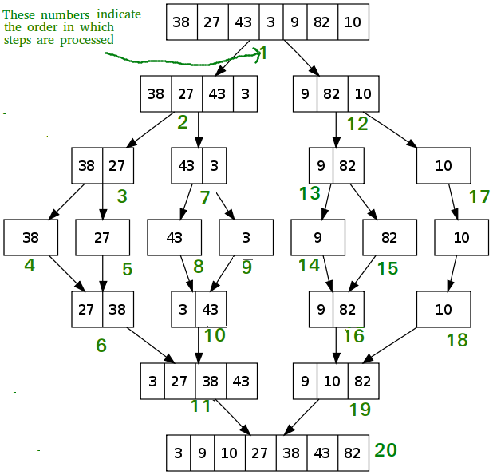

# Sorting Algorithm (정렬 알고리즘)
- [Selection Sort(선택 정렬)](#Selection-Sort)
- [Insertion Sort(삽입 정렬)](#Insertion-Sort)
- [Bubble Sort(버블 정렬)](#Bubble-Sort)
- [Quick Sort(퀵 정렬)](#Quick-Sort)
- [Merge Sort(머지 정렬)](#Merge-Sort)
- Heap Sort(힙 정렬)
- Radix Sort(래딕스 정렬)
- Count Sort(카운트 정렬)
- Bucket Sort(버킷 정렬)

| Name           | Average Case | Worst Case | 비고                                                                           |
|----------------|--------------|------------|--------------------------------------------------------------------------------|
| Selection Sort | О(n^2)       | О(n^2)     |                                                                                |
| Insertion Sort | О(n^2)       | О(n^2)     | small input에 적합                                                             |
| Bubble Sort    | О(n^2)       | О(n^2)     |                                                                                |
| Quick Sort     | O(nlgn)      | О(n^2)     |                                                                                |
| Merge Sort     | O(nlgn)      | O(nlgn)    |                                                                                |
| Heap Sort      | O(nlgn)      | O(nlgn)    | complete binary tree                                                           |
| Radix Sort     | O(nk)        | O(nk)      |                                                                                |
| Count Sort     | O(n+k)       | O(n+k)     | 비교를 하지 않고 정렬을 한다. 다만, n input은 int여야 하고, 0~k까지 여야 한다. |
| Bucket Sort    | O(n+k)       | О(n^2)     |                                                                                |

## Stable Sort

Stable sort란 중복된 키를 순서대로 정렬하는 정렬 알고리즘들을 지칭한다. 즉, 같은 값이 2개 이상 리스트에 등장할 때 기존 리스트에 있던 순서대로 중복된 키들이 정렬된 다는 것을 의미한다.

예를 들어, 다음과 같은 list가 있다고 가정해보자.

    numbers = [9, 3, 12, 1, 6, 2, 1]

이 리스트에서 1 이라는 값이 중복이 된다. 이때 중복되는 1의 값들을 구분해서 작성해보려고 한다. 

    numbers = [9, 3, 12, 1(1번째), 6, 2, 1(2번째)]

만약 이 리스트를 stable sort 알고리즘으로 정렬을 한다면 결과는 다음과 같을 것이다.

    [1(1번째), 1(2번째), 2, 3, 6, 9, 12]

이처럼 기존 리스트에서 중복된 값들에게 순서가 매겨졌는데, 그 순서대로 정렬이 됬을 때 이 알고리즘은 stable sort라고 부를 수 있는 것이다.

## 왜 Stable Sort이 중요한가?

그렇다면 왜 stable sort가 중요한지 궁금할 수 있다. 그 이유는 다음과 같다:

- stable sort로 정렬하는 알고리즘들의 순서는 항상 똑같기에 항상 결과가 같음을 보장할 수 있다.
- 숫자를 sorting할 때는 stability가 중요하지 않을 수 있지만, 첫 문자를 기준으로 문자열을 정렬하는 경우에서는 항상 안정적으로 같은 리스트가 리턴되는 것이 바람직할 것이다. (왜냐하면 정렬할 때마다 순서가 다르면 혼란스러울 수 있기 때문이다)

Stable Sorting 알고리즘은 다음과 같다:

- Insertion Sort
- Merge Sort
- Bubble Sort
- Counting Sort

Unstable Sorting 알고리즘은 다음과 같다:

- Heap Sort
- Selection sort
- Shell sort
- Quick Sort


## Inplace algrithm

Inplace 알고리즘이란 추가적인 메모리 공간을 많이 필요로 하지 않는 혹은 전혀 필요하지 않는 알고리즘을 의미한다. 통상적으로, 공간은 O(logn)이고 O(n)이 될 때도 있다.  

즉, n 길이의 리스트가 있고, 이 리스트를 정렬할 때 추가적으로 메모리 공간을 할당하지 않아도 정렬이 이뤄진다면 in-place 알고리즘이라고 불릴 수 있는 것이다.
<div align="center">

</div>

In-place하지 않은 알고리즘은 n 길이의 리스트를 정렬할 때 n 만큼의 메모리보다 더 많은 메모리 공간을 할당한다. 즉, 이런 알고리즘들은 space complexity가 높다. 

<div align="center">

</div>


<hr/>

## Selection Sort
<div align="center">

</div>

위는 Selection Sort(선택정렬)의 pseudo-코드이다. i가 1부터 시작하지만, 가장 첫 Index를 의미하고 프로그램을 할 때는 0 index이다. 알고리즘은 매 iteration마다 2가지 동작을 수행한다. list내에서 가장 작은 값을 찾고 list앞에다 정렬한다. 그 다음에 정렬된 값보다 하나 큰 값에서 다시 같은 알고리즘을 적용한다. <br/>

글로 풀어보면 다음과 같다:

1. min이란 변수에 i를 저장한다.
2. j에는 i +1 값을 대입한다.
3. j부터 list 끝까지 살펴보면서 가장 작은 값을 찾고 그 index를 min에 저장한다.
4. 만약 min 값이 바뀌었다면 i 자리의 item과 min 자리의 item을 바꾼다.
5. i += 1을 하고 1번으로 돌아간다.

<br/>
한 iteration에 list내의 모든 item을 살펴보고, 이러한 과정을 list의 길이만큼 진행하기 때문에 이 sorting algorithm의 시간 복잡도는 `O(n^2)`가 되는 것이다. iteration 수는 언제나 ist 길이와 같기 때문에 average와 worst case에서의 시간복잡도가 같다.

<div align="center">

</div>

<div align="center">

source: [stackoverflow_selection_sort](https://stackoverflow.com/questions/36700830/selection-sort-algorithm)

</div>


iteration 과정을 간단히 살펴보자

첫번째 iteration에서는 7부터 시작해서 list 전체를 흝고 1이 제일 작은 것을 파악했고 1을 맨 앞에 위치했다.

두번째 iteration에서는 1을 제외하고 그 다음 item인 4부터 시작해서 list 전체를 흝고 2가 제일 작음을 파악했다. 그래서 2를 1 다음에 위치했다.

세번째 iteration에서는 1,2를 제외하고 그 다음 item인 5부터 시작해서 list 전체를 흝고 4가 제일 작음을 파악했다. 그래서 1, 2 다음에 4를 뒀다.

...

iteration을 list의 item보다 하나 작은 수 만큼 반복을 하면 ⇒

**리스트가 정렬이 된다.**

### Python Code

```python
import random

def selection_sort(num):
    for i in range(len(num)):
        minimum = i
        for j in range(i+1, len(num)): # i보다 하나 큰 수부터 list끝까지 iterate한다
            if num[j] < num[minimum]: 
                minimum = j # list내에 제일 작은 숫자를 찾고 그 index를 minumum 변수에 저장한다
        if minimum != i: 
            num[i], num[minimum] = num[minimum], num[i]
    return num


number = [i for i in range(10)]
random.shuffle(number)
selection = selection_sort(number)
print(selection)
```

<br/>

## Insertion Sort

<div align="center">

</div>

위는 Insertion Sort(삽입정렬)의 pseudo-코드이다. j가 2부터 시작하고 이는 list내 2번째 item을 의미한다, 즉, 프로그래밍할 때는 index 1을 의미한다. 이 알고리즘은 list를 iterate하면서 list 앞 쪽부터 정렬을 해나간다. 정렬을 하고 나서 그 다음 item으로 이동하고 해당 item을 정렬된 왼쪽 list에 정렬된 순서에 삽입을 한다. <br/>

step별로 풀어보면 다음과 같다:

1. list의 2번째 item부터 시작한다. (첫번째 item은 이미 정렬된 list라고 간주한다, item이 하나인 list에서 그 item은 항상 정렬된 상태이기 때문이다)
2. key라는 변수에 list의 j번째 값을 저장한다.
3. i라는 변수에 j - 1 값을 저장한다. (list의 i번째 값을 왼쪽에 정렬된 list에 비교를 하며 삽입하기 위함이다)
4. while문
    1. key가 list[i]보다 작으면 list[i+1] (j의 위치를 의미한다)에 정렬된 list의 가장 큰 값을 복사한다.
    2. i -= 1 을 하고 4.1번을 반복한다. 만약 list맨 앞까지 도달하면 loop을 종료한다.
5. key 값을 list[i+1]에 저장한다. (이 부분이 정렬된 list에 새로운 숫자를 삽입하는 것처럼 보이게 만든다)
6. j += 1을 하고 2번부터 다시 반복한다.

<br/>
한 iteration에 list내의 모든 item을 한번 살펴본다. 그리고 iteration중에 선택된 item을 정렬된 list에서 다시 비교하며 살펴본다. 그래서, 이 sorting algorithm의 시간 복잡도는 `O(n^2)`가 되는 것이다.


<div align="center">

</div>


<div align="center">

source: [geeks-for-geeks-insertion-sort](https://www.geeksforgeeks.org/recursive-insertion-sort/)

</div>


그림에 있는 iteration 과정을 간단히 살펴보자

첫번째 iteration에서는 9는 이미 정렬된 상태이고, list[1]인 7과 index하나 작은 9와 비교를 한다. 7이 더 작기 때문에 7을 9앞으로 삽입을 한다. 

두번째 iteration에서는 [7,9]는 이미 정렬된 상태이고, list[2]인 6과 9를 비교한다. 9가 더 크기 때문에 한칸 더 왼쪽으로 움직여서 6과 7을 비교한다. 이때 6이 더 작기 때문에 맨 앞으로 삽입을 한다. 

세번째 iteration에서는 15가 정렬된 list [6,7,9] 중에서 가장 큰 9보다도 크기 때문에 추가적인 이동을 하지 않는다. 

...

list의 맨 마지막 item을 왼쪽에 정렬된 list에 정렬된 상태를 유지할만한 위치에 삽입을 하게 되면 ⇒

**리스트가 정렬이 된다.**

### Python Code

```python
import random

def insertion_sort(num):
    for j in range(1,len(num)):
        key = num[j] 
        i = j - 1
        while i>=0 and (num[i] > key): # i가 list맨 앞까지 오던지, num[i]가 위에 저장된 num[j]보다 작으면 loop빠져 나온다.
            num[i+1] = num[i]
            i -= 1
        num[i+1] = key
    return num


number = [i for i in range(10)]
random.shuffle(number)
print(number)
insertion = insertion_sort(number)
print(insertion)
```
<br/>

## Bubble Sort

<div align="center">

</div>

위는 Bubble Sort(버블정렬)의 pseudo-코드이다. 정렬을 한다고 했을 때 가장 떠올리기 쉽고 구현하기 쉬운 알고리즘이라고 생각한다. 처음에 2개씩 비교를 하면서 왼쪽이 오른쪽보다 크면 바꿔서 가장 큰 값이 iteration 마다 맨 뒤에 위치하게 한다. (반대로 가장 작은 값을 맨 앞으로 위치하게 만들 수 있다)

이 pseudo-코드대로 진행하면 다음과 같다:

1. list 맨앞부터 list의 길이까지 iteration 진행한다.
2. list 끝부터 시작해서 그 앞에 item과 비교를 하고 현 item이 더 작으면 swap을 한다, 이러한 비교를 i + 1까지 iteration 진행한다. 

pseudo-코드만 봐도 다른 알고리즘들보다 더 단순해보이는 것을 볼 수 있다. list길이만큼 iteration을 하는데, iteration마다 끝에서부터 맨 앞까지 다시 한번 iteration을 하며 item끼리 비교를 한다. 두 번의 for loop iteration의 횟수를 제곱만큼 늘리기 때문에 이 sorting algorithm의 시간 복잡도는 `O(n^2)`가 되는 것이다.

<div align="center">

</div>

<div align="center">

source: [programiz-bubble-sort](https://www.programiz.com/dsa/bubble-sort)

</div>


그림에 있는 iteration 과정을 간단히 살펴보자. 해당 그림은 pseudo-코드와는 반대 방향으로 진행되서 큰 값을 먼저 뒤로 위치했다.

두 번째 for loop내, 

첫번째 iteration에서 -2와 45를 비교했더니 오른쪽에 있는 45가 더 크기 때문에 다음으로 넘어간다.  

두번째 iteration에서는 45와 0을 비교하고 0이 더 작기 때문에 서로의 위치를 바꿨다. 

세번째 iteration에서는 45와 11을 비교하고 11이 더 작기 때문에 서로의 위치를 바꿨다. 

네번째 iteration에서는 45와 -9를 비교하고 -9가 더 작기 때문에 서로의 위치를 바꿨다.

이렇게 두 번째 for loop의 iteration이 끝나면, 가장 끝이 제일 큰 값으로 정렬된다. 그 다음번에서는 가장 마지막 item을 제외하고 나머지 item끼리만 비교를 한다.

### Python Code

그림과 비슷한 방향으로 코드를 작성했다

```python
import random

def bubble_sort(num):
    for i in range(len(num)):
        for j in range(len(num)-1-i): # 맨 앞부터 비교를 시작한다
            if num[j]>num[j+1]:
                num[j], num[j+1] = num[j+1], num[j] # swap한다
    return num


number = [i for i in range(10)]
random.shuffle(number)
print(number)
bubble = bubble_sort(number)
print(bubble)
```

<br/>

## Quick Sort

<div align="center">

</div>

Quick sort는 `Divide and Conquer(분할 정복)` 알고리즘 종류중 하나이다. 분할정복이란 주어진 문제를 여러 sub 문제들로 나눈 다음에 그 문제들을 해결한 다음에 합치는 것을 의미한다. Quicksort는 임의의 숫자를 기준으로 정한 다음에 그 숫자보다 작은 숫자들과 큰 숫자들에 다시 재귀를 사용해서 quick sort 알고리즘을 적용한다. 그러면 다시 그 분할된 숫자들 중에서 기준을 정하고 나눠서 quick sort를 진행한다. 

조금 더 자세히 설명하면, 임의의 숫자를 고르고 나서 해당 숫자보다 작은 숫자들을 왼쪽에 위치시키고, 해당 숫자보다 큰 숫자들을 오른쪽에 위치시킨다. 그러고 나서 정해진 임의의 숫자를 그 중간에 위치시키는 것이다.

`Partition` 부분을 자세히 살펴보기 전에 각 인자들이 무엇을 의미하는지 보려고 한다. `A`는 주어진 list이다. `p`는 주어진 list의 lower part로 list의 시작 부분을 의미하고, `r`은 주어진 list의 higher part로 list의 끝 부분을 의미한다.

1. pivot을 정한다
2. i는 list의 시작 index보다 하나 작게 둔다. i는 pivot인 A[r]보다 작은 숫자들의 list 중 가장 높은 index를 의미한다.
3. j는 주어진 list의 시작 부분인 p부터 시작해서 r-1까지 반복한다.
    1. item이 pivot보다 작으면 i+=1을 해준다. pivot보다 작은 수들의 index 범위를 늘리는 작업이다.
    2. 그러고 나서 서로 swap을 해준다.
4. 마지막에 pivot을 pivot보다 작은 수 그리고 큰 수들로 나뉜 구간 중간에 위치시킨다.
5. i+1, 즉, pivot의 위치 index를 리턴한다.

Quick sort는 추가적으로 메모리를 사용하지 않고 할당된 list의 메모리만 사용하기 때문에 `inplace` 알고리즘으로 불린다. 물론, 구현 방법에 따라서 non-inplace 알고리즘으로도 작성될 수 있다.

Quick sort 알고리즘의 평균 시간 복잡도는 `O(nlgn)`이다. Worse case는 pivot으로 항상 list의 가장 작은 값 혹은 가장 큰 값으로 정했을 때 발생하고 그 때의 시간 복잡도는 `O(n^2)`가 된다. 하지만, 보통 pivot을 정할 때 랜덤으로 정하기 때문에 평균적으로는 시간복잡도가 `O(nlgn)`이 된다. 


<div align="center">

</div>

<div align="center">

source: [studytonight-quick-sort](https://www.studytonight.com/data-structures/quick-sort)

</div>


이제 그림을 보면서 quick sort가 sorting을 하는 과정을 살펴보자. 해당 그림은 Iteration마다 바뀌는 과정을 보여주는 것이 아니라 한번 divide되고 conquer되는 과정을 보여준다. 그림 내 6개의 작은 그림들이 있는데 각각 step1~6으로 표현을 하려고 한다.

- step1에서는, pivot은 list[r]인 6이 선택되었다.

- step2에서는, 6은 3번째 index에 위치하게 되었고, 해당 index를 기준으로 왼쪽 index들의 값들은 6보다 작고, 오른쪽은 6보다 크다. 6이 자기 자리를 찾았기 때문에 정렬되었다고 간주를 한다. 그러고 나서 새로운 pivot들을 선택하게 되고, 숫자 6을 기준으로 왼쪽 list인 [2,3,5]와 오른쪽 list인 [7,9,10,11,14,12]에서 각각 새로운 pivot들이 정해졌다.

- step3에서는, 3과 11을 정렬된 자리에 이동을 시켰다. 그러고 나서 3의 좌우 list에서 각각 pivot(2,5)을 고르고, 11의 좌우 list에서 각각 pivot(10,12)을 선택했다.

- ste4에서는, 2와 5는 각각 자신들이 p이자 r이기 때문에 정렬된 상태로 간주되었다. 10을 기준으로 왼쪽에 자신보다 큰 숫자들이 없으니 그대로 위치 이동을 안하고 12는 한칸 이동을 했다. 그러고 나서 다시 pivot(9,14)를 선택했다.

- step5에서는, 9와 14를 더 움직일 곳이 없었기 때문에 정렬된 상태로 간주했다. 그러고 마지막 pivot으로 선택되지 않았던, 7을 선택한다.

- step6에서는, 7이 p이자 r이기 때문에 정렬된 상태로 간주하게 된다. 이렇게 되면, 전체 list가 정렬이 된다.

위에서 QuickSort 알고리즘을 호출할 때 필요한 인자들의 의미는 설명했고, 이제 초기에 어떤 값을 넣어야 하는지 설명하려고 한다. `A`자리에는 정렬해야할 list를 넘기고, `p`의 자리에는 list의 시작 index, `r`자리에는 list의 가장 마지막 index를 전달하면 된다.


### Python Code

그림과 비슷한 방향으로 코드를 작성했다

```python
import random

class QuickSort:
    def __init__(self, num):
        self.num = num

    def quick_sort(self, p, r):
        # p는 list시작, r은 끝, q는 중간인 pivot
        if p<r:
            q = self.partition(p,r)
            self.quick_sort(p,q-1) # pivot의 왼쪽을 다시 분할한다
            self.quick_sort(q+1,r) # pivot의 오른쪽을 다시 분할한다
        

    def partition(self, p, r):
        x = self.num[r] # pivot 값 저장
        i = p - 1
        for j in range(p, r): 
            if self.num[j] <= x: # pivot보다 작으면 해당 값을 pivot index보다 왼쪽으로 이동시킨다
                i += 1
                self.num[i], self.num[j] = self.num[j] ,self.num[i] 
        self.num[i+1], self.num[r] = self.num[r], self.num[i+1] # pivot을 전체 list에 정렬된 위치에 놓는다
        return i+1  # pivot의 위치를 리턴한다


number = [i for i in range(10)]
random.shuffle(number)
print(number)
quick = QuickSort(number)
quick.quick_sort(0, len(number)-1) # list의 첫 index와 가장 마지막 index를 전달한다
print(quick.num)
```

<br/>

## Merge Sort

<div align="center">

</div>

Merge Sort(합병정렬)는 `Divide and Conquer(분할 정복)` 알고리즘 종류중 하나이다. 분할정복이란 주어진 문제를 여러 sub 문제들로 나눈 다음에 그 문제들을 해결한 다음에 합치는 것을 의미한다. 

### Pseudo-code 설명

Merge-sort와 Merge parameter에서 `A`는 정렬이 필요한 list이다. `p`는 list의 가장 앞 index, `q`는 list의 중간 index, `r`은 list의 마지막 index를 의미한다.

**Merge Sort**

: 이 함수는 정렬되지 않은 list를 분할하는 역할을 한다

- p<r 이면, 아직 정렬이 완성되지 않은 상태라고 간주해서, p와 r의 중간인 q를 구한다
- (p\~q), (q+1\~r) 로 list를 분할하고 merge 함수에 보낸다.

**Merge**

: 이 함수는 분할된 list를 합병하는 역할을 한다.

- 1~2라인: n1은 분할된 왼쪽 list의 길이이고 n2는 분할된 오른쪽 list의 길이이다.
- 3~7라인: 그 다음에 L과 R을 길이만큼 선언해준 다음에 정렬되지 않는 list에서 해당 index를 받아와서 L과 R을 채워준다.
- 8~11라인: pseudo-code에서는 1이 가장 첫 index를 의미하기 때문에 i,j = 1로 설정되었다.
- 12~17라인: L과 R의 item들을 비교하고 더 작은 값을 기존 list의 왼쪽에, 더 큰 값을 list의 오른쪽에 배치를 한다.


<div align="center">

</div>

<div align="center">

source: <a href="https://www.geeksforgeeks.org/merge-sort/">merge-sort</a>

</div>


그림을 보며 step들을 하나씩 따라가보자

step1 - 전체 list를 분할한다.

step2 - p<r이기 때문에 왼쪽 list 다시 분할한다

step3 - p<r이기 때문에 왼쪽 list 다시 분할한다

step4~6 - 분할된 list를 병합한다. 둘을 비교하고 더 작은 값을 왼쪽에 위치 시킨다.

step 7 - 이전 merge가 끝났으니 상위 recursion으로 돌아가서 오른쪽 list를 분할한다.

step8~10 - 분할된 list를 합병한다. 둘을 비교하고 더 작은 값을 왼쪽에 위치 시킨다.

step 11 - 이 부분을 이해하기 위해서는 코드로 살펴보자.

```python
while i < len(L) and j < len(R): 
    if L[i] < R[j]: 
        num[k] = L[i] 
        i+=1
    else: 
        num[k] = R[j] 
        j+=1
    k+=1
```

[27,38] [3,43] 을 병합하는 과정을 살펴보면, 각각 list의 첫인자를 보고 비교를 한다. 

- 3이 더 작으니 [3] 이 먼저 들어가게 된다.
- 그 다음에 27과 43을 비교하고 27이 더 작은니 [3,27]이 된다.
- 그 다음에는 38과 43을 비교하고 38이 더 작은니 [3, 27, 38] 이 된다.
- 하지만 이제 i가 2가 되어서 len(L)과 같아졌기 때문에 while문을 빠져 나오게 된다.

이때 나머지 43을 덧붙히기 위해서는 밑에 코드들이 필요하다. 숫자가 남았다는 것은 다른 숫자들 보다 값이 컸다는 의미이다. 그래서 남은 길이만큼 기존 list에 붙혀서 [3, 27, 38, 43] 이 되는 것이다.

```python
while i < len(L): 
    num[k] = L[i] 
    i+=1
    k+=1

while j < len(R): 
    num[k] = R[j] 
    j+=1
    k+=1
```

그 이후로 다시 상위 recursion으로 돌아가서 똑같은 작업을 진행한다.


### Python Code

위에 pseudo-code와는 다르게 구성을 했다. 이전에는 함수 2개를 만들어서 recursion으로 했지만, 하나의 함수로 같은 알고리즘을 구현했다.

```python
import random
    
def merge_sort(num): 
    if len(num) >1: 
        mid = len(num)//2 # list의 중간을 찾는다
        L = num[:mid] # list의 왼쪽을 분할한다
        R = num[mid:] # list의 오른쪽을 분할한다
    
        merge_sort(L) # 왼쪽 list를 정렬한다
        merge_sort(R) # 오른쪽 list를 정렬한다
    
        i = j = k = 0
            
        # 일시적으로 만든 L과 R을 비교한다
        while i < len(L) and j < len(R): 
            if L[i] < R[j]: # 왼쪽 list에 있던 item이 더 작으면 L[i]를 list 왼쪽에 위치하게 한다
                num[k] = L[i] 
                i+=1
            else: # 오른쪽 list에 있던 item이 더 작으면 R[j]를 list 왼쪽에 위치하게 한다
                num[k] = R[j] 
                j+=1
            k+=1
            
        # 위에 len(L) and len(R)이었기 때문에, 더 긴 list의 숫자가 남았을 것이다,
        # 그 숫자들을 이어 붙힌다.
        # 남은 숫자들은 크기 때문에 남은 것이기에 오른쪽에 붙혀진다
        while i < len(L): 
            num[k] = L[i] 
            i+=1
            k+=1
            
        while j < len(R): 
            num[k] = R[j] 
            j+=1
            k+=1

            

number = [i for i in range(10)]
random.shuffle(number)
print(number)
merge = merge_sort(number)
print(number)
```

<br/>