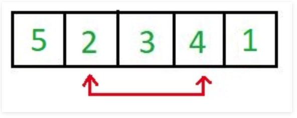
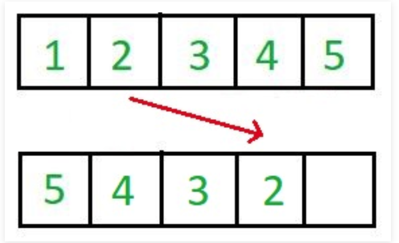
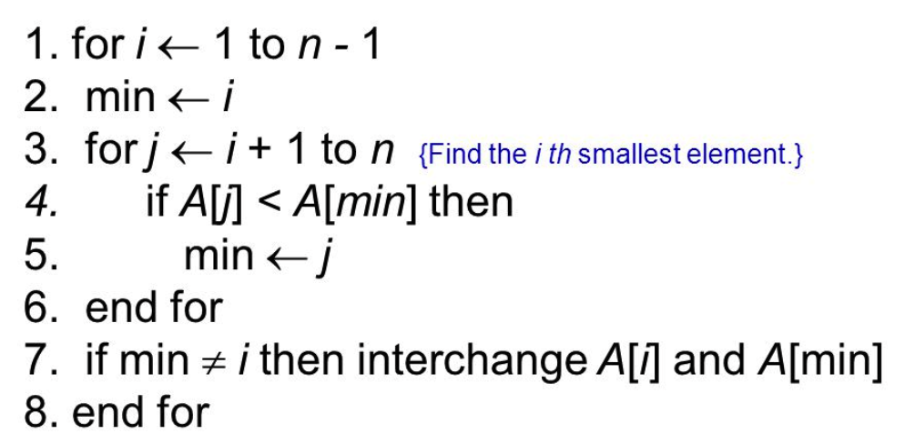

# Sorting Algorithm (정렬 알고리즘)
- [Selection Sort(선택 정렬)](#Selection-Sort)
- Insertion Sort(삽입 정렬)
- Bubble Sort(버블 정렬)
- Quick Sort(퀵 정렬)
- Merge Sort(머지 정렬)
- Heap Sort(힙 정렬)
- Radix Sort(래딕스 정렬)
- Count Sort(카운트 정렬)
- Bucket Sort(버킷 정렬)

| Name           | Average Case | Worst Case | 비고                                                                           |
|----------------|--------------|------------|--------------------------------------------------------------------------------|
| Selection Sort | О(n^2)       | О(n^2)     |                                                                                |
| Insertion Sort | О(n^2)       | О(n^2)     | small input에 적합                                                             |
| Bubble Sort    | О(n^2)       | О(n^2)     |                                                                                |
| Quick Sort     | O(nlgn)      | О(n^2)     |                                                                                |
| Merge Sort     | O(nlgn)      | O(nlgn)    |                                                                                |
| Heap Sort      | O(nlgn)      | O(nlgn)    | complete binary tree                                                           |
| Radix Sort     | O(nk)        | O(nk)      |                                                                                |
| Count Sort     | O(n+k)       | O(n+k)     | 비교를 하지 않고 정렬을 한다. 다만, n input은 int여야 하고, 0~k까지 여야 한다. |
| Bucket Sort    | O(n+k)       | О(n^2)     |                                                                                |

## Stable Sort

Stable sort란 중복된 키를 순서대로 정렬하는 정렬 알고리즘들을 지칭한다. 즉, 같은 값이 2개 이상 리스트에 등장할 때 기존 리스트에 있던 순서대로 중복된 키들이 정렬된 다는 것을 의미한다.

예를 들어, 다음과 같은 list가 있다고 가정해보자.

    numbers = [9, 3, 12, 1, 6, 2, 1]

이 리스트에서 1 이라는 값이 중복이 된다. 이때 중복되는 1의 값들을 구분해서 작성해보려고 한다. 

    numbers = [9, 3, 12, 1(1번째), 6, 2, 1(2번째)]

만약 이 리스트를 stable sort 알고리즘으로 정렬을 한다면 결과는 다음과 같을 것이다.

    [1(1번째), 1(2번째), 2, 3, 6, 9, 12]

이처럼 기존 리스트에서 중복된 값들에게 순서가 매겨졌는데, 그 순서대로 정렬이 됬을 때 이 알고리즘은 stable sort라고 부를 수 있는 것이다.

## 왜 Stable Sort이 중요한가?

그렇다면 왜 stable sort가 중요한지 궁금할 수 있다. 그 이유는 다음과 같다:

- stable sort로 정렬하는 알고리즘들의 순서는 항상 똑같기에 항상 결과가 같음을 보장할 수 있다.
- 숫자를 sorting할 때는 stability가 중요하지 않을 수 있지만, 첫 문자를 기준으로 문자열을 정렬하는 경우에서는 항상 안정적으로 같은 리스트가 리턴되는 것이 바람직할 것이다. (왜냐하면 정렬할 때마다 순서가 다르면 혼란스러울 수 있기 때문이다)

Stable Sorting 알고리즘은 다음과 같다:

- Insertion Sort
- Merge Sort
- Bubble Sort
- Counting Sort

Unstable Sorting 알고리즘은 다음과 같다:

- Heap Sort
- Selection sort
- Shell sort
- Quick Sort


## Inplace algrithm

Inplace 알고리즘이란 추가적인 메모리 공간을 많이 필요로 하지 않는 혹은 전혀 필요하지 않는 알고리즘을 의미한다. 통상적으로, 공간은 O(logn)이고 O(n)이 될 때도 있다.  

즉, n 길이의 리스트가 있고, 이 리스트를 정렬할 때 추가적으로 메모리 공간을 할당하지 않아도 정렬이 이뤄진다면 in-place 알고리즘이라고 불릴 수 있는 것이다.
<div align="center">

</div>

In-place하지 않은 알고리즘은 n 길이의 리스트를 정렬할 때 n 만큼의 메모리보다 더 많은 메모리 공간을 할당한다. 즉, 이런 알고리즘들은 space complexity가 높다. 

<div align="center">

</div>


<hr/>

## Selection Sort
<div align="center">

</div>

위는 Selection Sort(선택정렬)의 pseudo-코드이다. 알고리즘은 매 iteration마다 2가지 동작을 수행한다. list내에서 가장 작은 값을 찾고 list앞에다 정렬한다. 그 다음에 정렬된 값보다 하나 큰 값에서 다시 같은 알고리즘을 적용한다. 글로 풀어보면 다음과 같다:

1. min이란 변수에 i를 저장한다.
2. j에는 i +1 값을 대입한다.
3. j부터 list 끝까지 살펴보면서 가장 작은 값을 찾고 그 index를 min에 저장한다.
4. 만약 min 값이 바뀌었다면 i 자리의 item과 min 자리의 item을 바꾼다.
5. i += 1을 하고 1번으로 돌아간다.

한 iteration에 list내의 모든 item을 살펴보고, 이러한 과정을 list의 길이만큼 진행하기 때문에 이 sorting algorithm의 시간 복잡도는 `O(n^2)`가 되는 것이다. iteration 수는 언제나 i의 길이와 같기 때문에 average와 worst case에서의 시간복잡도가 같다.

<div align="center">

</div>

source: [stackoverflow_selection_sort](https://stackoverflow.com/questions/36700830/selection-sort-algorithm)

iteration 과정을 간단히 살펴보자

첫번째 iteration에서는 7부터 시작해서 list 전체를 흝고 1이 제일 작은 것을 파악했고 1을 맨 앞에 위치했다.

두번째 iteration에서는 1을 제외하고 그 다음 item인 4부터 시작해서 list 전체를 흝고 2가 제일 작음을 파악했다. 그래서 2를 1 다음에 위치했다.

세번째 iteration에서는 1,2를 제외하고 그 다음 item인 5부터 시작해서 list 전체를 흝고 4가 제일 작음을 파악했다. 그래서 1, 2 다음에 4를 뒀다.

...

iteration을 list의 item보다 하난 작은 수 만큼 반복을 하면 ⇒

**리스트가 정렬이 된다.**

### Python Code

```python
import random

def selection_sort(num):
    for i in range(len(num)):
        minimum = i
        for j in range(i+1, len(num)):
            if num[j] < num[minimum]:
                minimum = j
        if minimum != i:
            num[i], num[minimum] = num[minimum], num[i]
    return num


number = [i for i in range(10)]
random.shuffle(number)
selection = selection_sort(number)
print(selection)
```