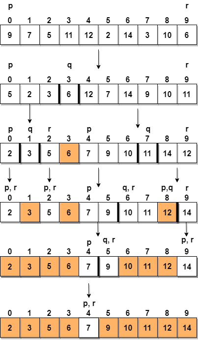
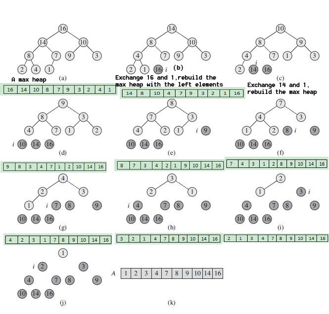
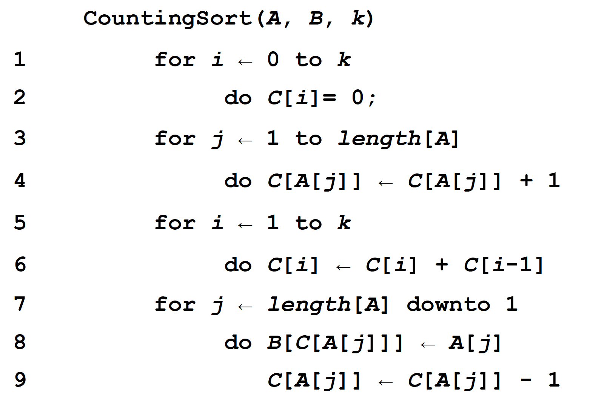
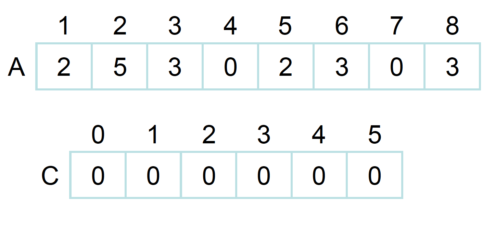
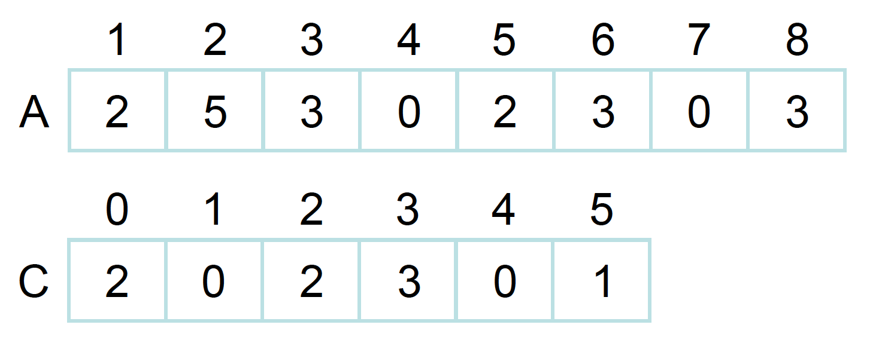
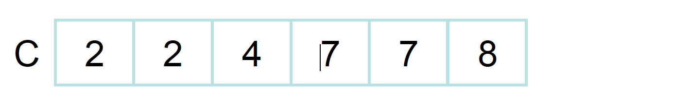
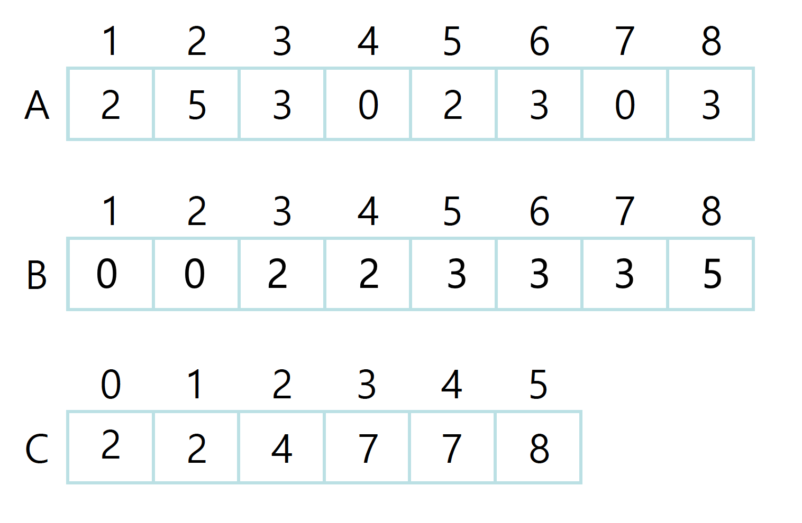

# Sorting Algorithm (정렬 알고리즘)
- [Selection Sort(선택 정렬)](#Selection-Sort)
- [Insertion Sort(삽입 정렬)](#Insertion-Sort)
- [Bubble Sort(버블 정렬)](#Bubble-Sort)
- [Quick Sort(퀵 정렬)](#Quick-Sort)
- [Merge Sort(머지 정렬)](#Merge-Sort)
- [Heap Sort(힙 정렬)](#Heap-Sort)
- [Counting Sort(계수 정렬)](#Counting-Sort)
- [Radix Sort(기수 정렬)](#Radix-Sort)
- [Bucket Sort(버킷 정렬)](#Buckeet-Sort)

| Name           | Average Case | Worst Case | 비고                                    |
|----------------|--------------|------------|--------------------------------------------------------------------------------------|
| Selection Sort | О(n^2)       | О(n^2)     |                                        |
| Insertion Sort | О(n^2)       | О(n^2)     | small input에 적합                      |
| Bubble Sort    | О(n^2)       | О(n^2)     |                                        |
| Quick Sort     | O(nlgn)      | О(n^2)     |                                        |
| Merge Sort     | O(nlgn)      | O(nlgn)    |                                        |
| Heap Sort      | O(nlgn)      | O(nlgn)    | complete binary tree                   |
| Count Sort     | O(n+k)       | O(n+k)     | 비교를 하지 않고 정렬을 한다. 다만, n input은 int여야 하고, 0~k까지 여야 한다. |
| Radix Sort     | O(nk)        | O(nk)      |                                                                   |        
| Bucket Sort    | O(n+k)       | О(n^2)     |                                                                   |

## Stable Sort

Stable sort란 중복된 키를 순서대로 정렬하는 정렬 알고리즘들을 지칭한다. 즉, 같은 값이 2개 이상 리스트에 등장할 때 기존 리스트에 있던 순서대로 중복된 키들이 정렬된 다는 것을 의미한다.

예를 들어, 다음과 같은 list가 있다고 가정해보자.

    numbers = [9, 3, 12, 1, 6, 2, 1]

이 리스트에서 1 이라는 값이 중복이 된다. 이때 중복되는 1의 값들을 구분해서 작성해보려고 한다. 

    numbers = [9, 3, 12, 1(1번째), 6, 2, 1(2번째)]

만약 이 리스트를 stable sort 알고리즘으로 정렬을 한다면 결과는 다음과 같을 것이다.

    [1(1번째), 1(2번째), 2, 3, 6, 9, 12]

이처럼 기존 리스트에서 중복된 값들에게 순서가 매겨졌는데, 그 순서대로 정렬이 됬을 때 이 알고리즘은 stable sort라고 부를 수 있는 것이다.

## 왜 Stable Sort이 중요한가?

그렇다면 왜 stable sort가 중요한지 궁금할 수 있다. 그 이유는 다음과 같다:

- stable sort로 정렬하는 알고리즘들의 순서는 항상 똑같기에 항상 결과가 같음을 보장할 수 있다.
- 숫자를 sorting할 때는 stability가 중요하지 않을 수 있지만, 첫 문자를 기준으로 문자열을 정렬하는 경우에서는 항상 안정적으로 같은 리스트가 리턴되는 것이 바람직할 것이다. (왜냐하면 정렬할 때마다 순서가 다르면 혼란스러울 수 있기 때문이다)

Stable Sorting 알고리즘은 다음과 같다:

- Insertion Sort
- Merge Sort
- Bubble Sort
- Counting Sort

Unstable Sorting 알고리즘은 다음과 같다:

- Heap Sort
- Selection sort
- Shell sort
- Quick Sort


## Inplace algrithm

Inplace 알고리즘이란 추가적인 메모리 공간을 많이 필요로 하지 않는 혹은 전혀 필요하지 않는 알고리즘을 의미한다. 통상적으로, 공간은 O(logn)이고 O(n)이 될 때도 있다.  

즉, n 길이의 리스트가 있고, 이 리스트를 정렬할 때 추가적으로 메모리 공간을 할당하지 않아도 정렬이 이뤄진다면 in-place 알고리즘이라고 불릴 수 있는 것이다.
<div align="center">

</div>

In-place하지 않은 알고리즘은 n 길이의 리스트를 정렬할 때 n 만큼의 메모리보다 더 많은 메모리 공간을 할당한다. 즉, 이런 알고리즘들은 space complexity가 높다. 

<div align="center">

</div>


<hr/>

## Selection Sort
<div align="center">

</div>

위는 Selection Sort(선택정렬)의 pseudo-코드이다. i가 1부터 시작하지만, 가장 첫 Index를 의미하고 프로그램을 할 때는 0 index이다. 알고리즘은 매 iteration마다 2가지 동작을 수행한다. list내에서 가장 작은 값을 찾고 list앞에다 정렬한다. 그 다음에 정렬된 값보다 하나 큰 값에서 다시 같은 알고리즘을 적용한다. <br/>

글로 풀어보면 다음과 같다:

1. min이란 변수에 i를 저장한다.
2. j에는 i +1 값을 대입한다.
3. j부터 list 끝까지 살펴보면서 가장 작은 값을 찾고 그 index를 min에 저장한다.
4. 만약 min 값이 바뀌었다면 i 자리의 item과 min 자리의 item을 바꾼다.
5. i += 1을 하고 1번으로 돌아간다.

<br/>
한 iteration에 list내의 모든 item을 살펴보고, 이러한 과정을 list의 길이만큼 진행하기 때문에 이 sorting algorithm의 시간 복잡도는 `O(n^2)`가 되는 것이다. iteration 수는 언제나 ist 길이와 같기 때문에 average와 worst case에서의 시간복잡도가 같다.

<div align="center">

</div>

<div align="center">

source: [stackoverflow_selection_sort](https://stackoverflow.com/questions/36700830/selection-sort-algorithm)

</div>


iteration 과정을 간단히 살펴보자

첫번째 iteration에서는 7부터 시작해서 list 전체를 흝고 1이 제일 작은 것을 파악했고 1을 맨 앞에 위치했다.

두번째 iteration에서는 1을 제외하고 그 다음 item인 4부터 시작해서 list 전체를 흝고 2가 제일 작음을 파악했다. 그래서 2를 1 다음에 위치했다.

세번째 iteration에서는 1,2를 제외하고 그 다음 item인 5부터 시작해서 list 전체를 흝고 4가 제일 작음을 파악했다. 그래서 1, 2 다음에 4를 뒀다.

...

iteration을 list의 item보다 하나 작은 수 만큼 반복을 하면 ⇒

**리스트가 정렬이 된다.**

### Python Code

```python
import random

def selection_sort(num):
    for i in range(len(num)):
        minimum = i
        for j in range(i+1, len(num)): # i보다 하나 큰 수부터 list끝까지 iterate한다
            if num[j] < num[minimum]: 
                minimum = j # list내에 제일 작은 숫자를 찾고 그 index를 minumum 변수에 저장한다
        if minimum != i: 
            num[i], num[minimum] = num[minimum], num[i]
    return num


number = [i for i in range(10)]
random.shuffle(number)
selection = selection_sort(number)
print(selection)
```

<br/>

## Insertion Sort

<div align="center">

</div>

위는 Insertion Sort(삽입정렬)의 pseudo-코드이다. j가 2부터 시작하고 이는 list내 2번째 item을 의미한다, 즉, 프로그래밍할 때는 index 1을 의미한다. 이 알고리즘은 list를 iterate하면서 list 앞 쪽부터 정렬을 해나간다. 정렬을 하고 나서 그 다음 item으로 이동하고 해당 item을 정렬된 왼쪽 list에 정렬된 순서에 삽입을 한다. <br/>

step별로 풀어보면 다음과 같다:

1. list의 2번째 item부터 시작한다. (첫번째 item은 이미 정렬된 list라고 간주한다, item이 하나인 list에서 그 item은 항상 정렬된 상태이기 때문이다)
2. key라는 변수에 list의 j번째 값을 저장한다.
3. i라는 변수에 j - 1 값을 저장한다. (list의 i번째 값을 왼쪽에 정렬된 list에 비교를 하며 삽입하기 위함이다)
4. while문
    1. key가 list[i]보다 작으면 list[i+1] (j의 위치를 의미한다)에 정렬된 list의 가장 큰 값을 복사한다.
    2. i -= 1 을 하고 4.1번을 반복한다. 만약 list맨 앞까지 도달하면 loop을 종료한다.
5. key 값을 list[i+1]에 저장한다. (이 부분이 정렬된 list에 새로운 숫자를 삽입하는 것처럼 보이게 만든다)
6. j += 1을 하고 2번부터 다시 반복한다.

<br/>
한 iteration에 list내의 모든 item을 한번 살펴본다. 그리고 iteration중에 선택된 item을 정렬된 list에서 다시 비교하며 살펴본다. 그래서, 이 sorting algorithm의 시간 복잡도는 `O(n^2)`가 되는 것이다.


<div align="center">

</div>


<div align="center">

source: [geeks-for-geeks-insertion-sort](https://www.geeksforgeeks.org/recursive-insertion-sort/)

</div>


그림에 있는 iteration 과정을 간단히 살펴보자

첫번째 iteration에서는 9는 이미 정렬된 상태이고, list[1]인 7과 index하나 작은 9와 비교를 한다. 7이 더 작기 때문에 7을 9앞으로 삽입을 한다. 

두번째 iteration에서는 [7,9]는 이미 정렬된 상태이고, list[2]인 6과 9를 비교한다. 9가 더 크기 때문에 한칸 더 왼쪽으로 움직여서 6과 7을 비교한다. 이때 6이 더 작기 때문에 맨 앞으로 삽입을 한다. 

세번째 iteration에서는 15가 정렬된 list [6,7,9] 중에서 가장 큰 9보다도 크기 때문에 추가적인 이동을 하지 않는다. 

...

list의 맨 마지막 item을 왼쪽에 정렬된 list에 정렬된 상태를 유지할만한 위치에 삽입을 하게 되면 ⇒

**리스트가 정렬이 된다.**

### Python Code

```python
import random

def insertion_sort(num):
    for j in range(1,len(num)):
        key = num[j] 
        i = j - 1
        while i>=0 and (num[i] > key): # i가 list맨 앞까지 오던지, num[i]가 위에 저장된 num[j]보다 작으면 loop빠져 나온다.
            num[i+1] = num[i]
            i -= 1
        num[i+1] = key
    return num


number = [i for i in range(10)]
random.shuffle(number)
print(number)
insertion = insertion_sort(number)
print(insertion)
```
<br/>

## Bubble Sort

<div align="center">

</div>

위는 Bubble Sort(버블정렬)의 pseudo-코드이다. 정렬을 한다고 했을 때 가장 떠올리기 쉽고 구현하기 쉬운 알고리즘이라고 생각한다. 처음에 2개씩 비교를 하면서 왼쪽이 오른쪽보다 크면 바꿔서 가장 큰 값이 iteration 마다 맨 뒤에 위치하게 한다. (반대로 가장 작은 값을 맨 앞으로 위치하게 만들 수 있다)

이 pseudo-코드대로 진행하면 다음과 같다:

1. list 맨앞부터 list의 길이까지 iteration 진행한다.
2. list 끝부터 시작해서 그 앞에 item과 비교를 하고 현 item이 더 작으면 swap을 한다, 이러한 비교를 i + 1까지 iteration 진행한다. 

pseudo-코드만 봐도 다른 알고리즘들보다 더 단순해보이는 것을 볼 수 있다. list길이만큼 iteration을 하는데, iteration마다 끝에서부터 맨 앞까지 다시 한번 iteration을 하며 item끼리 비교를 한다. 두 번의 for loop iteration의 횟수를 제곱만큼 늘리기 때문에 이 sorting algorithm의 시간 복잡도는 `O(n^2)`가 되는 것이다.

<div align="center">

</div>

<div align="center">

source: [programiz-bubble-sort](https://www.programiz.com/dsa/bubble-sort)

</div>


그림에 있는 iteration 과정을 간단히 살펴보자. 해당 그림은 pseudo-코드와는 반대 방향으로 진행되서 큰 값을 먼저 뒤로 위치했다.

두 번째 for loop내, 

첫번째 iteration에서 -2와 45를 비교했더니 오른쪽에 있는 45가 더 크기 때문에 다음으로 넘어간다.  

두번째 iteration에서는 45와 0을 비교하고 0이 더 작기 때문에 서로의 위치를 바꿨다. 

세번째 iteration에서는 45와 11을 비교하고 11이 더 작기 때문에 서로의 위치를 바꿨다. 

네번째 iteration에서는 45와 -9를 비교하고 -9가 더 작기 때문에 서로의 위치를 바꿨다.

이렇게 두 번째 for loop의 iteration이 끝나면, 가장 끝이 제일 큰 값으로 정렬된다. 그 다음번에서는 가장 마지막 item을 제외하고 나머지 item끼리만 비교를 한다.

### Python Code

그림과 비슷한 방향으로 코드를 작성했다

```python
import random

def bubble_sort(num):
    for i in range(len(num)):
        for j in range(len(num)-1-i): # 맨 앞부터 비교를 시작한다
            if num[j]>num[j+1]:
                num[j], num[j+1] = num[j+1], num[j] # swap한다
    return num


number = [i for i in range(10)]
random.shuffle(number)
print(number)
bubble = bubble_sort(number)
print(bubble)
```

<br/>

## Quick Sort

<div align="center">

</div>

Quick sort는 `Divide and Conquer(분할 정복)` 알고리즘 종류중 하나이다. 분할정복이란 주어진 문제를 여러 sub 문제들로 나눈 다음에 그 문제들을 해결한 다음에 합치는 것을 의미한다. Quicksort는 임의의 숫자를 기준으로 정한 다음에 그 숫자보다 작은 숫자들과 큰 숫자들에 다시 재귀를 사용해서 quick sort 알고리즘을 적용한다. 그러면 다시 그 분할된 숫자들 중에서 기준을 정하고 나눠서 quick sort를 진행한다. 

조금 더 자세히 설명하면, 임의의 숫자를 고르고 나서 해당 숫자보다 작은 숫자들을 왼쪽에 위치시키고, 해당 숫자보다 큰 숫자들을 오른쪽에 위치시킨다. 그러고 나서 정해진 임의의 숫자를 그 중간에 위치시키는 것이다.

`Partition` 부분을 자세히 살펴보기 전에 각 인자들이 무엇을 의미하는지 보려고 한다. `A`는 주어진 list이다. `p`는 주어진 list의 lower part로 list의 시작 부분을 의미하고, `r`은 주어진 list의 higher part로 list의 끝 부분을 의미한다.

1. pivot을 정한다
2. i는 list의 시작 index보다 하나 작게 둔다. i는 pivot인 A[r]보다 작은 숫자들의 list 중 가장 높은 index를 의미한다.
3. j는 주어진 list의 시작 부분인 p부터 시작해서 r-1까지 반복한다.
    1. item이 pivot보다 작으면 i+=1을 해준다. pivot보다 작은 수들의 index 범위를 늘리는 작업이다.
    2. 그러고 나서 서로 swap을 해준다.
4. 마지막에 pivot을 pivot보다 작은 수 그리고 큰 수들로 나뉜 구간 중간에 위치시킨다.
5. i+1, 즉, pivot의 위치 index를 리턴한다.

Quick sort는 추가적으로 메모리를 사용하지 않고 할당된 list의 메모리만 사용하기 때문에 `inplace` 알고리즘으로 불린다. 물론, 구현 방법에 따라서 non-inplace 알고리즘으로도 작성될 수 있다.

Quick sort 알고리즘의 평균 시간 복잡도는 `O(nlgn)`이다. Worse case는 pivot으로 항상 list의 가장 작은 값 혹은 가장 큰 값으로 정했을 때 발생하고 그 때의 시간 복잡도는 `O(n^2)`가 된다. 하지만, 보통 pivot을 정할 때 랜덤으로 정하기 때문에 평균적으로는 시간복잡도가 `O(nlgn)`이 된다. 


<div align="center">

</div>

<div align="center">

source: [studytonight-quick-sort](https://www.studytonight.com/data-structures/quick-sort)

</div>


이제 그림을 보면서 quick sort가 sorting을 하는 과정을 살펴보자. 해당 그림은 Iteration마다 바뀌는 과정을 보여주는 것이 아니라 한번 divide되고 conquer되는 과정을 보여준다. 그림 내 6개의 작은 그림들이 있는데 각각 step1~6으로 표현을 하려고 한다.

- step1에서는, pivot은 list[r]인 6이 선택되었다.

- step2에서는, 6은 3번째 index에 위치하게 되었고, 해당 index를 기준으로 왼쪽 index들의 값들은 6보다 작고, 오른쪽은 6보다 크다. 6이 자기 자리를 찾았기 때문에 정렬되었다고 간주를 한다. 그러고 나서 새로운 pivot들을 선택하게 되고, 숫자 6을 기준으로 왼쪽 list인 [2,3,5]와 오른쪽 list인 [7,9,10,11,14,12]에서 각각 새로운 pivot들이 정해졌다.

- step3에서는, 3과 11을 정렬된 자리에 이동을 시켰다. 그러고 나서 3의 좌우 list에서 각각 pivot(2,5)을 고르고, 11의 좌우 list에서 각각 pivot(10,12)을 선택했다.

- ste4에서는, 2와 5는 각각 자신들이 p이자 r이기 때문에 정렬된 상태로 간주되었다. 10을 기준으로 왼쪽에 자신보다 큰 숫자들이 없으니 그대로 위치 이동을 안하고 12는 한칸 이동을 했다. 그러고 나서 다시 pivot(9,14)를 선택했다.

- step5에서는, 9와 14를 더 움직일 곳이 없었기 때문에 정렬된 상태로 간주했다. 그러고 마지막 pivot으로 선택되지 않았던, 7을 선택한다.

- step6에서는, 7이 p이자 r이기 때문에 정렬된 상태로 간주하게 된다. 이렇게 되면, 전체 list가 정렬이 된다.

위에서 QuickSort 알고리즘을 호출할 때 필요한 인자들의 의미는 설명했고, 이제 초기에 어떤 값을 넣어야 하는지 설명하려고 한다. `A`자리에는 정렬해야할 list를 넘기고, `p`의 자리에는 list의 시작 index, `r`자리에는 list의 가장 마지막 index를 전달하면 된다.


### Python Code

그림과 비슷한 방향으로 코드를 작성했다

```python
import random

class QuickSort:
    def __init__(self, num):
        self.num = num

    def quick_sort(self, p, r):
        # p는 list시작, r은 끝, q는 중간인 pivot
        if p<r:
            q = self.partition(p,r)
            self.quick_sort(p,q-1) # pivot의 왼쪽을 다시 분할한다
            self.quick_sort(q+1,r) # pivot의 오른쪽을 다시 분할한다
        

    def partition(self, p, r):
        x = self.num[r] # pivot 값 저장
        i = p - 1
        for j in range(p, r): 
            if self.num[j] <= x: # pivot보다 작으면 해당 값을 pivot index보다 왼쪽으로 이동시킨다
                i += 1
                self.num[i], self.num[j] = self.num[j] ,self.num[i] 
        self.num[i+1], self.num[r] = self.num[r], self.num[i+1] # pivot을 전체 list에 정렬된 위치에 놓는다
        return i+1  # pivot의 위치를 리턴한다


number = [i for i in range(10)]
random.shuffle(number)
print(number)
quick = QuickSort(number)
quick.quick_sort(0, len(number)-1) # list의 첫 index와 가장 마지막 index를 전달한다
print(quick.num)
```

<br/>

## Merge Sort

<div align="center">

</div>

Merge Sort(합병정렬)는 `Divide and Conquer(분할 정복)` 알고리즘 종류중 하나이다. 분할정복이란 주어진 문제를 여러 sub 문제들로 나눈 다음에 그 문제들을 해결한 다음에 합치는 것을 의미한다. 

### Pseudo-code 설명

Merge-sort와 Merge parameter에서 `A`는 정렬이 필요한 list이다. `p`는 list의 가장 앞 index, `q`는 list의 중간 index, `r`은 list의 마지막 index를 의미한다.

**Merge Sort**

: 이 함수는 정렬되지 않은 list를 분할하는 역할을 한다

- p<r 이면, 아직 정렬이 완성되지 않은 상태라고 간주해서, p와 r의 중간인 q를 구한다
- (p\~q), (q+1\~r) 로 list를 분할하고 merge 함수에 보낸다.

**Merge**

: 이 함수는 분할된 list를 합병하는 역할을 한다.

- 1~2라인: n1은 분할된 왼쪽 list의 길이이고 n2는 분할된 오른쪽 list의 길이이다.
- 3~7라인: 그 다음에 L과 R을 길이만큼 선언해준 다음에 정렬되지 않는 list에서 해당 index를 받아와서 L과 R을 채워준다.
- 8~11라인: pseudo-code에서는 1이 가장 첫 index를 의미하기 때문에 i,j = 1로 설정되었다.
- 12~17라인: L과 R의 item들을 비교하고 더 작은 값을 기존 list의 왼쪽에, 더 큰 값을 list의 오른쪽에 배치를 한다.


<div align="center">

</div>

<div align="center">

source: <a href="https://www.geeksforgeeks.org/merge-sort/">merge-sort</a>

</div>


그림을 보며 step들을 하나씩 따라가보자

step1 - 전체 list를 분할한다.

step2 - p<r이기 때문에 왼쪽 list 다시 분할한다

step3 - p<r이기 때문에 왼쪽 list 다시 분할한다

step4~6 - 분할된 list를 병합한다. 둘을 비교하고 더 작은 값을 왼쪽에 위치 시킨다.

step 7 - 이전 merge가 끝났으니 상위 recursion으로 돌아가서 오른쪽 list를 분할한다.

step8~10 - 분할된 list를 합병한다. 둘을 비교하고 더 작은 값을 왼쪽에 위치 시킨다.

step 11 - 이 부분을 이해하기 위해서는 코드로 살펴보자.

```python
while i < len(L) and j < len(R): 
    if L[i] < R[j]: 
        num[k] = L[i] 
        i+=1
    else: 
        num[k] = R[j] 
        j+=1
    k+=1
```

[27,38] [3,43] 을 병합하는 과정을 살펴보면, 각각 list의 첫인자를 보고 비교를 한다. 

- 3이 더 작으니 [3] 이 먼저 들어가게 된다.
- 그 다음에 27과 43을 비교하고 27이 더 작은니 [3,27]이 된다.
- 그 다음에는 38과 43을 비교하고 38이 더 작은니 [3, 27, 38] 이 된다.
- 하지만 이제 i가 2가 되어서 len(L)과 같아졌기 때문에 while문을 빠져 나오게 된다.

이때 나머지 43을 덧붙히기 위해서는 밑에 코드들이 필요하다. 숫자가 남았다는 것은 다른 숫자들 보다 값이 컸다는 의미이다. 그래서 남은 길이만큼 기존 list에 붙혀서 [3, 27, 38, 43] 이 되는 것이다.

```python
while i < len(L): 
    num[k] = L[i] 
    i+=1
    k+=1

while j < len(R): 
    num[k] = R[j] 
    j+=1
    k+=1
```

그 이후로 다시 상위 recursion으로 돌아가서 똑같은 작업을 진행한다.


### Python Code

위에 pseudo-code와는 다르게 구성을 했다. 이전에는 함수 2개를 만들어서 recursion으로 했지만, 하나의 함수로 같은 알고리즘을 구현했다.

```python
import random
    
def merge_sort(num): 
    if len(num) >1: 
        mid = len(num)//2 # list의 중간을 찾는다
        L = num[:mid] # list의 왼쪽을 분할한다
        R = num[mid:] # list의 오른쪽을 분할한다
    
        merge_sort(L) # 왼쪽 list를 정렬한다
        merge_sort(R) # 오른쪽 list를 정렬한다
    
        i = j = k = 0
            
        # 일시적으로 만든 L과 R을 비교한다
        while i < len(L) and j < len(R): 
            if L[i] < R[j]: # 왼쪽 list에 있던 item이 더 작으면 L[i]를 list 왼쪽에 위치하게 한다
                num[k] = L[i] 
                i+=1
            else: # 오른쪽 list에 있던 item이 더 작으면 R[j]를 list 왼쪽에 위치하게 한다
                num[k] = R[j] 
                j+=1
            k+=1
            
        # 위에 len(L) and len(R)이었기 때문에, 더 긴 list의 숫자가 남았을 것이다,
        # 그 숫자들을 이어 붙힌다.
        # 남은 숫자들은 크기 때문에 남은 것이기에 오른쪽에 붙혀진다
        while i < len(L): 
            num[k] = L[i] 
            i+=1
            k+=1
            
        while j < len(R): 
            num[k] = R[j] 
            j+=1
            k+=1

            

number = [i for i in range(10)]
random.shuffle(number)
print(number)
merge = merge_sort(number)
print(number)
```

<br/>


## Heap Sort

Heap Sort(힙정렬)는 `Complete Binary Tree(완전 이진 트리)` 형식의 자료구조를 사용해서 정렬을 하는 알고리즘이다. 완전 이진 트리란 각 level마다 왼쪽부터 채워넣은 트리의 구조를 의미한다. Binary Heap을 parent 노드가 두개의 child 노드보다 크게 만들수도 있고 작게 만들수도 있다. 전자는 `max heap`이라고 부르고, 후자는 `min heap`이라고 부른다. 이 Heap은 binary tree로 나타낼 수 있지만, 일반 array로도 나타낼 수 있다. 

### 어떻게 Binary Heap을 array로 나타내는가?

Binary Heap이 완전 이진 트리이기 때문에 array로 나타낼 수 있는 것이다. Parent 노드가 l 인덱스에 있다고 가정해보자. 그렇다면 왼쪽의 자식 노드의 index는 2 * l + 1 로 알아낼 수 있고 오른쪽 자식 노드는 2 * l + 2로 알아낼 수 있다. 자식 노드들은 반대로 계산해서 parent 노드의 index를 알아낼 수 있다.

이렇게 array를 이진 트리처럼 연상을 해서 풀 수 있다.

<div align="center">

</div>

### Pseudo-code 설명

Pseudo-code를 하나씩 보기 전에 알고리즘의 기본 작동법을 알아보려고 한다.

작은 숫자 → 큰 숫자로 정렬하려면, `max heap`을 사용해야 한다. `max heap`이기 때문에 가장 큰 숫자가 root에 위치해 있다. 이 root를 가장 마지막 노드와 swap을 하고 array의 사이즈를 하나 줄인다. 이렇게 되면 가장 큰 숫자 순으로 array 맨 뒤에 위치하게 되는 것이다. Swap을 하고나서 `heapify`라는 메커니즘을 사용해서 남아있는 숫자들 중 가장 큰 수를 root로 이동시킨다. 이 동작을 반복하면 sorting이 되는 것이다.

이제 pseudo-code를 하나씩 들여다 보자.

- line 2: BUILD-MAX-HEAP(line 7~10)이라는 함수를 호출하는데, 이 함수는 주어진 array를 heapify해서  `max heap`을 이룰 수 있도록 하는 작업이다. (parent 노드가 자식 노드들보다 큰 트리)
- line 3: for loop
    - line 4: root인 숫자와 array 가장 마지막 숫자와 swap한다.
    - line 5: heapSize를 하나 줄여서, 정렬된 숫자는 이후에 heapify 과정을 안 거치게 한다.
    - line 6: heapify를 하는 MAX-HEAPIFY 함수를 호출한다. 이 함수는 recursion으로 작동한다.
- line 12~13: 자식 노드들의 index를 각각 L,R 변수에 저장한다.
- line 14: 만약 왼쪽 노드가 heapSize보다 작고, 그 값이 주어진 노드의 값보다 크면
    - line 15: L이 가장 큰 숫자의 index인 것으로 간주한다
    - line 16~17: 만약 아니라면, 현재 주어진 노드가 가장 큰 숫자의 index인 것으로 간주한다.
- line 18: L과 i를 비교해서 어떤게 더 큰 숫자를 가진 index인지 확인을 했으니 오른쪽 노드와 비교를 한다.
    - line 19: 오른쪽 노드가 L, i 보다 큰 숫자를 가지고 있으면 R을 가장 큰 숫자의 index로 간주한다.
- line 20: 만약 가장 큰 값의 index가 i가 아니라면,
    - line 21: i 자리에 있는 숫자와 가장 큰 값의 index 자리에 있는 숫자를 swap한다.
    - line 22: MAX-HEAPIFY를 다시 진행하되, largest로 heapify를 시작한다.
### Time Complexity & inplace, stable 여부


Heap sort는 추가적인 메모리를 사용하지 않고 하나의 array로 sorting을 하기 때문에 `in-place`알고리즘이다. 반면에, `unstable`하다. 

시간복잡도는 `O(nlgn)`이다. Heapify하는 과정은 tree의 높이만큼 하기 때문에 `O(lgn)`이다. 처음에 heap을 만드는 과정은 array의 길이만큼 이뤄지기 때문에 `O(n)`이다. 이 둘을 합해서 `O(nlgn)`이 나오는 것이다.


<div align="center">

</div>

그림을 보면서 Heap sort 진행과정을 하나씩 살펴보려고 한다. 머리속으로 진행과정을 그리면서 보면 이해가 어느정도 갈 것입니다.

a. a에서 이미 첫 heapify과정을 마친 상태이다. 

b. root와 가장 마지막 노드를 swap하고 heapSize -= 1을 한다. 그리고 root가 1인데 자식 노드들보다 작기 때문에 heapify과정을 거친다.

- 1은 14와 10중 더 큰 숫자인 14와 swap되서 왼쪽 자식 노드로 이동한다.
- 다시 1의 자식 노드를 봤더니 8과 7이 있고 그 중 더 큰 숫자인 8과 swap되고 다시 왼쪽 자식 노드로 이동한다.
- 1의 자식 노드는 2와 4기에, 4와 swap되서 오른쪽 자식 노드로 이동한다. 그렇게 해서 만들어진 트리의 모양이 (b)의 그림이다.

c. root인 14와 가장 마지막 노드인 1과 swap하고 heapSize -= 1을 한다. 다시 heapify과정을 거친다.

- 8과 10중 10이 더 크기에 10과 1이 swap되고, 1은 오른쪽 노드로 이동한다.
- 자식 노드들이 9와 3이기에, 9와 swap되서 1은 왼쪽 노드로 이동한다. 그렇게 해서 만들어진ㄴ 트리의 모양이 (c)의 그림이다.

...

이렇게 쭉 진행하면 sorting된 array를 얻을 수 있게 된다.


### Python Code

```python
import random

class HeapSort:
    def __init__(self, num, heapSize):
        self.num = num
        self.heapSize = heapSize

    def heap_sort(self):
        for i in range(len(self.num), -1, -1): 
            self.max_heapify(i) 
   
        for i in range(len(self.num)-1, 0, -1):
            self.num[0], self.num[i] = self.num[i], self.num[0]
            self.heapSize -= 1
            self.max_heapify(0)


    def max_heapify(self, i):
        largest = i
        L = 2 * i + 1
        R = 2 * i + 2
        
        if (L < self.heapSize) and (self.num[L] > self.num[i]):
            largest = L
        else:
            largest = i

        if (R < self.heapSize) and (self.num[R] > self.num[largest]):
            largest = R
        
        if largest != i:
            self.num[i], self.num[largest] = self.num[largest], self.num[i]
            self.max_heapify(largest)
         

number = [i for i in range(10)]
random.shuffle(number)
print(number)
heap = HeapSort(number, len(number))
heap.heap_sort()
print(heap.num)
    
```

<br/>


## Counting Sort

Counting Sort(계수정렬)은 숫자들간 **비교를 하지 않고 정렬을** 하는 알고리즘이다. 일일이 비교를 하지 않고 각 숫자가 몇개인지 센 다음에 정렬을 하기 떄문에 시간복잡도는 `O(n)`이 나오게 된다. 다만, Counting sort는 모든 리스트에 적용을 할 수는 없고, 일정한 **조건**을 만족하는 리스트들에만 해당 알고리즘을 적용할 수 있다. 조건들은 다음과 같다:

1. 리스트 내의 모든 element들은 **정수**여야 한다
2. 리스트 내의 모든 element들의 **범위는 0~k (k는 정수)**여야 한다
3. **k=O(n)**으로 나타나질 수 있어야 한다

<div align="center">

</div>

이제 pseudo 코드를 라인별로 분석해보려고 한다.

<div align="center">

</div>

A라는 정렬되지 않은 리스트를 정렬하고자 한다. 

- **라인 1~2** : C라는 리스트를 새로 만드는데, 이 C의 길이는 **k**이다. Counting sort의 범위는 0\~k가 되어야 한다고 했고, 현재 주어진 리스트에서 k는 5이다. 그래서 0~5, 총 길이 6인 C리스트가 만들어지는 것이다.

<div align="center">

</div>

- **라인 3~4**: 이제 C라는 리스트에 각각 element들이 몇개인지 추가를 한다. 초기에 C는 0으로 초기화 되있고, A를 0번째 index부터 길이까지 순회를 하면서 해당되는 값을 C에 1씩 더해나간다. `C[A[j]] = C[A[j]] + 1` 이 부분을 예시로 설명해보자면,
    1. 처음에 A의 0번째 index 값인 2가 들어온다. A[j]는 2가 되고 C[A[j]]는 C[2]가 되는 것이다. 그러면 기존 C[2]의 값인 0에다 1을 더해서 1이 된다. 
    2. 그다음에 1번째 index의 값인 5가 들어오고, 이는 C[5]에 1을 더하게 된다.

    ...

이런 식으로 진행하다보면 0이 몇개인지, 1이 몇개인지...k가 몇개인지 C 리스트를 통해서 알 수 있게 된다.

<div align="center">

</div>

- **라인 5~6**: C 리스트의 element들을 누적값으로 바꾼다. 0번째 index는 그대로 두고, 1번째 index는 이전값에 자신의 값을 더한다 2+0 = 2, 2번째 index도 이전 값에 자신을 더한다 2+2=4....이렇게 더하다 보면 C의 맨 마지막 element는 당연하게도 **A의 길이**가 된다.

<div align="center">

</div>

- **라인 7~9**: 마지막 for loop에서는 C로 정렬된 B 리스트를 만들어낸다. A의 값을 보고 그 값을 index 삼아서 C의 값을 본다. C의 값을 index삼아서 A의 값을 B에 넣고, 누적 C의 값을 -1 해준다. 말이 어렵기 때문에 한 단계씩 살펴보자
    1. A[0]의 값 2를 보게된다. 이 값을 C의 index로 사용한다 C[2]. 
    2. C[2]의 값은 4이기 때문에 B[4]에 A[0]의 값인 2를 넣게 되는 것이다. B[C[A[j]]] 가 이러한 의미를 가졌다. (실제로는 index가 0부터 시작이기 때문에 B[C[A[j]]-1]을 해줘야 한다)
    3. 그 다음에 2를 사용했기 때문에 누적값을 하나 줄여줘야 한다. 그래서 C[2] -= 1을 한다

    loop을 한번 돌때마다 이러한 동작을 진행하게 되고, A의 마지막 element를 B에 넣을 때까지 진행이 된다.

### **Time Complexity & inplace, stable 여부**

- 라인 1~2는 0\~k이기 때문에 `O(k)`이다
- 라인 3~4는 n까지여서 `O(n)`이다
- 라인 5~6은 k까지여서 `O(k)`이다
- 라인 7~9는 n까지여서 `O(n)`이다

시간복잡도를 다 더하면 `O(n+k)`가 된다. 만약 **k=O(n)** 이면 counting sort의 시간복잡도는 `O(n)`이 된다. 정렬을 하는 것이 이렇게 빠를 수 있는 이유는 counting sort는 비교를 하지 않기 때문이다. 하지만, k의 값이 너무 커지면 일반 정렬 알고리즘보다 느려질 수 있는 단점이 있다. 

Counting sort는 기존 element들의 순서를 지키면서 정렬을 시키기 때문에 `stable` sort로 분류된다. 하지만, 추가적인 메모리를 요구하기 때문에 `in-place` 알고리즘은 아니다.

### Python Code

```python
def couting_sort(A, k):
    B = [0] * len(A)
    C = [0] * (k+1)

    for i in range(len(A)): # 각 element가 몇개있는지 C에 저장한다
        C[A[i]] += 1
    
    for i in range(1,len(C)): # C를 누적값으로 바꾼다
        C[i] += C[i-1]

    for i in range(len(A)): # C를 indexing해서 B에 저장한다
        B[C[A[i]]-1] = A[i]
        C[A[i]] -= 1

    return B
        
counting_number = [1, 0, 3, 1, 0, 2, 5, 2, 1, 4]
print(counting_number)
count = couting_sort(counting_number, max(counting_number))
print(count)
```

<br/>


## Radix Sort

## Bucket Sort