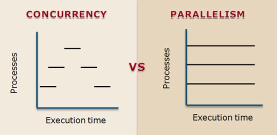

# Effective Python [파이썬 코딩의 기술] - Ch 5 - Concurrency and Parallelism (병행성과 병렬성)

해당 책은 다음의 링크에서 다운받을 수 있습니다 (영문) : [LINK](https://arisuchan.jp/λ/src/1498628824511-0.pdf)

> Effecive Python은 Python을 잘쓰기 위한 방법들을 소개하고 있다. 총 59가지이지만 흔히 아는 방법은 설명으로 적지 않았다. 그리고 비슷한 내용이지만 여러 파트에 나뉜 경우에 하나로 합쳐서 작성하기도 했다.

Concurrency와 parallelism의 차이가 무엇인지 살펴보려고 한다. 해당 내용은 [stackoverflow-what-is-difference-between-concurrency-and-parallelism](https://stackoverflow.com/questions/1050222/what-is-the-difference-between-concurrency-and-parallelism) 에서 가지고 왔다.

Concurrency는 2개 혹은 그 이상의 작업들이 시작, 실행, 끝나기까지 서로 겹치는 시간대에 이뤄질 수 있음을 의미한다. 꼭, 여러 작업이 동시에 시작하는 것을 의미한다. 예를 들어, 하나의 CPU core를 가진 컴퓨터에서 os는 싱글 프로세서에서 실행되는 프로그램들을 왔다 갔다 한다. 그래서 마치 모든 작업들이 동시에 이뤄지는 것처럽 보이는 것이다. 

Parallelism은 말 그래도 작업들이 동시에 진행되는 것이다. 예를 들어, multiple CPU core를 가진 컴퓨터에서 multiple 프로그램들이 동시에 실행이 된다. 각 CPU core는 다른 프로그램들이 동시에 진행될 수 있도록 해준다.  




둘의 가장 큰 차이점은 **속도**이다. 프로그램이 parallel하게 진행이 되면 전체 실행시간에서 반을 줄 일 수 있다. 반면에, concurrent 프로그램은 여러 프로그램들이 돌아가는 것처럼 보이지만 전체 실행 시간은 줄어들지 않는다.

Python에서 concurrent 프로그램 매우 쉽게 작성할 수 있다. Parallel 프로그램도 system calls, subprocesses, C-extenssions를 사용해서 작성할 수 있지만, 실제로는 concurrent Python 코드를 parallel하게 만드는 것은 매우 어렵다.   그럼에도, 각 상황마다 Python을 최대한 활용하기 위한 방법들을 알아볼 예정이다. 

# Item 36: Child Processes 관리하기 위해 subprocess 사용하기

Python에 의해 시작된 child process들은 parallel로 실행될 수 있다. 그래서 python으로 하여금 모든 CPU의 core를 사용해서 프로그램의 throughpu을 최대화할 수 있게 해준다. 

지금까지 Python으로 subprocess 실행시키는 방법으로는 *popen, open2, os.exec** 등이 있었다. 하지만, 최근 Python에서 child process를 관리하는 최적의 방법은 `subprocess`라는 built-in 모듈을 사용하는 것이다. 이 `subprocess`를 사용하는 것은 매우 간단하다.

```python
proc = subprocess.Popen(
			[‘echo’, ‘Hello from the child!’],
			stdout=subprocess.PIPE)
out, err = proc.communicate()
print(out.decode(‘utf-8’))

# Hello from the child!
```

`Popen` constructor가 process를 시작한다. `communicate` method는 child process의 결과를 읽고 종료까지 기다린다. Child process는 parent process 인 Python 인터프리터로부터 독립적으로 실행된다. 

```python
# child method만들어서 run
def run_sleep(period):
	proc = subprocess.Popen([‘sleep’, str(period)])
	return procstart = time()

procs = []
for _ in range(10):
	proc = run_sleep(0.1)
	procs.append(proc)

# communicate method
for proc in procs:
	proc.communicate()
end = time()
print(‘Finished in %.3f seconds’ % (end - start))
```

`subprocess`를 사용하면 parallel(병렬)하게 프로그램을 사용할 수 있다. Openssl command-line tool을 사용해서 어떠한 데이터를 encrypt(암호화)한다고 가정해보자. Child process를 cmd-line arguments로 시작하고 I/O를 pip하는 것은 쉬운 일이다. 

```python
def run_openssl(data):
	env = os.environ.copy()
	env[‘password’] = b’\xe24U\n\xd0Ql3S\x11’
	proc = subprocess.Popen(
			[‘openssl’, ‘enc’, ‘-des3’, ‘-pass’, ‘env:password’],
			env=env,
			stdin=subprocess.PIPE,
			stdout=subprocess.PIPE)
	proc.stdin.write(data)
	proc.stdin.flush() # Ensure the child gets input
	return proc
```

여기서 랜덤한 byte들을 암호화하는 함수에 pipe를 한다. (실제 상황에서라면 유저의 input, network socket등이 될 것이다) 

child process가 parallel하게 run 하고 input을 받게 된다. `communicate` method로 모두가 끝날 때 까지 기다리고 최종 결과를 받는다 

```python
procs = []
for _ in range(3):
	data = os.urandom(10)
	proc = run_openssl(data)
	procs.append(proc)

for proc in procs:
	out, err = proc.communicate()
	print(out[-10:])

# b’o4,G\x91\x95\xfe\xa0\xaa\xb7’
# b’\x0b\x01\\xb1\xb7\xfb\xb2C\xe1b’
# b’ds\xc5\xf4;j\x1f\xd0c-‘
```

만약 child process가 끝나지 않는 것이 걱정되거나 input 혹은 output pipe가 어쩌다가 막히는 것이 걱정되면 `communicate` method에 `timeout` 인자를 전달하는 것도 방법이다. 인자로 전달된 시간 안에 child process가 반응을 안하면 exception을 발생시키고 종료를 한다. 

```python
proc = run_sleep(10)
try:
	proc.communicate(timeout=0.1)
except subprocess.TimeoutExpired:
	proc.terminate()
	proc.wait()
print(‘Exit status’, proc.poll())
```

이 `timeout`인자는 Python 3.3 혹은 그 이후 버전에서만 사용이 가능하다.

# Item 37: Thread를 Blocking I/O용으로 사용하고,  Parallelism용으로는 사용하지 않기

Python의 표준 구현 방법은 CPython이라고 불린다. CPython은 Python 프로그램 두 단계로 실행한다. 먼저, source text를 bytecode로 파싱하고 컴파일한다. 그 다음에는 bytecode를 stack을 기반으로 한 인터프리터에서 실행한다. Python은 coherence(일관성, 결합성)를 강제하는데 이 메커니즘은 global interpreter lock(GIL)이라고 불린다.

본래, GIL은 상호배타적이어서 Cpython이 preemptive(선점적) multithreading, 한 thread가 다른 thread를 interrupt해서 프로그램의 통제하는 것,의 영향 받는 것을 방지한다. 

하지만, GIL도 치명적인 단점이 있다. Java나 C++로 작성한 프로그램에서 multi thread가 있으면 multiple CPU core를 동시에 사용할 수 있음을 의미한다. Python이 multi thread를 지원하긴 하지만, GIL은 한 타임마다 한 thread씩만 실행시킨다. 즉, GIL을 사용하면 parallel computation이 되지 않는다는 것이다.

예를 한번 보자, 밑에는 factorization하는 알고리즘인데 큰 숫자들을 순차적으로 함수에 넣었을 때 compute하는데 꽤 긴 시간이 걸린다.

```python
# factorization 하는 알고리즘
def factorize(number):
	for i in range(1, number + 1):
		if number % i == 0:
			yield i

numbers = [2139079, 1214759, 1516637, 1852285]
start = time()
for number in numbers:
	list(factorize(number))
end = time()
print(‘Took %.3f seconds’ % (end - start))

# Took 1.040 seconds
```

다른 언어에서라면 multi-thread를 사용해서 CPU core을 효율적으로 사용하는 것이 가능하다. 여기서 이제 Python으로 thread를 사용해서 결과를 보려고 한다. list의 개수 만큼 thread를 형성하고 thread가 실행이 되게 한다. 그러고 나서 모든 thread가 실행을 마칠 때 까지 기다렸다가 시간을 비교해봤다.

```python
from threading import Thread

class FactorizeThread(Thread):
	def __init__(self, number):
		super().__init__()
		self.number = number

	def run(self):
		self.factors = list(factorize(self.number))

start = time()
threads = []
for number in numbers:
	thread = FactorizeThread(number)
	thread.start()
	threads.append(thread)

for thread in threads:
	thread.join()
end = time()
print(‘Took %.3f seconds’ % (end - start))

# Took 1.061 seconds
```

해당 프로그램이 걸린 시간을 보면 thread를 사용하지 않았을 때보다도 더 오래 걸린 것을 볼 수 있다. 다른 언어에서라면 multi-thread를 사용해서 최대 4배(list 개수) 빨라졌을 것이다. 이 예제로 GIL이 multiple CPU를 최대로 활용하지 못한다는 것을 볼 수 있다. 

CPython으로 multiple core를 사용하는 방법이 있긴 하지만, 표준 `Thread` class로는 불가능하다. 

그렇다면 다음과 같은 질문이 생길 수 있다 - Python은 왜 thread를 지원할까? 이에 대한 이유는 다음과 같다:

1. multiple thread로 여러 task를 동시에 실행 시킬 수 있다. 여러 task들의 순서를 정하는 등 직접 구현하는 것은 어렵다. Thread를 사용하면 여러 task들을 Python이 알아서 실행시킨다. (물론, GIL 때문에 parallel하게 이뤄지지는 않는다)
2. Python이 thread를 지원한는 것은 blocking I/O를 다루기 위함이다. Blocking I/O는 특정한 system call에서 발생하고 파일 읽기, 쓰기, 네트워크와 상호작용 등을 포함한다.

### Blocking I/O에 thread 사용하기

예를 들어, serial port로 원격 조종되는 헬리곱터에 signal을 보낸다고 가정해보자. 예시에서 `select`라는 system call을 사용할 것인데, 이는 os에게 0.1초 block을 요청한 다음 프로그램으로 돌아간다. 

```python
import select

def slow_systemcall():
	select.select([], [], [], 0.1)

start = time()
for _ in range(5):
	slow_systemcall()
end = time()
print(‘Took %.3f seconds’ % (end - start))

# Took 0.503 seconds
```

이 프로그램은 아직 thread를 사용하지 않았고, 가장 큰 단점은 signal을 보내면서 움직임을 가져갈 수 없다는 것이다. Main thread가 `select` system call에 block되었기 때문이다. Blocking I/O와 computation이 동시에 일어나야 제대로 작동을 할 수 있다. 이럴 때 system call을 thread로 변경해야 한다.

```python
start = time()
threads = []
for _ in range(5):
	thread = Thread(target=slow_systemcall)
	thread.start()
	threads.append(thread)

def compute_helicopter_location(index):
	# …

for i in range(5):
	compute_helicopter_location(i)
for thread in threads:
	thread.join()
end = time()
print(‘Took %.3f seconds’ % (end - start))

# Took 0.102 seconds
```

System call만 thread로 적용하니 이전에 비해 5배나 빨라진 것을 볼 수 있다. Python thread가 GIL로 인해 parallel computaion이 불가능하지만 system call은 parallel로 이뤄질 수 있음을 확인할 수 있다. 

**결론적으로, Python의 thread를 parallel하게 사용하고 싶으면 I/O blocking하는 상황에서 사용해야 한다.** 그 외에는 thread로 CPU core의 자원을 최대로 활용하기 어렵다.


# Item 38: Thread에서 Lock을 사용해서 Data Races 막기

Item 37에서 GIL이 상호 배타적이라는 것을 봤다. 하지만, 모든 상황에서 lock처럼 작동하는 것이 아니다, multiple thread로 같은 object에 접근을 하면 interruption일 발생해 문제가 생길 수 있다. 

여러 숫자들을 parallel로 세는 프로그램을 한번 작성해보자.

```python
class Counter(object):
    def __init__(self):
        self.count = 0

    def increment(self, offset):
        self.count += offset

def worker(sensor_index, how_many, counter):
    for _ in range(how_many):
        # Read from the sensor
        # …
        counter.increment(1)

def run_threads(func, how_many, counter):
    threads = []
    for i in range(5):
        args = (i, how_many, counter)
        thread = Thread(target=func, args=args)
        threads.append(thread)
        thread.start()
    for thread in threads:
        thread.join()
```

해당 프로그램은 5개의 thread를 만들어서 숫자를 세는 프로그램이다. 10^5 를 5번 세기 때문에 500000가 나올 것으로 예상했지만, 결과는 완전 달랐다.

```python
how_many = 10**5
counter = Counter()
run_threads(worker, how_many, counter)
print(‘Counter should be %d, found %d’ %(5 * how_many, counter.count))
# Counter should be 500000, found 278328
```

Python 인터프리터가 작동하는 방법 때문에 이러한 결과가 나오게 된 것이다. Python 인터프러터는 한 thread를 실행하다가 다른 thread를 번갈아가면서 실행한다. 유저는 언제 어떤 thread가 실행되는지 알 수는 없다. 

```python
counter.count += offset 
```

Counter object의 increment method에 있는 코드는 내부적으로 밑과 같이 작동한다. 이 사이에서 다른 thread로 변경이 되면 우리가 원하는 방향과 다르게 프로그램이 실행이 되는 것이다. `Data race`가 발생하는 것이다.

```python
value = getattr(counter, ‘count’)
result = value + offset
setattr(counter, ‘count’, result)
```

이러한 `data race`를 방지하기 위해서는 `Lock` class를 사용해야 한다. 이 class로 현재 값이 여러 multiple thread에 의해 동시에 접근하는 것을 방지할 수 있다. 한 thread가 한 타임에 그 값에 접근할 수 있게 된다.

프로그램을 실행시키면 우리가 원했던 결과를 얻을 수 있게 된다.

```python
class LockingCounter(object):
    def __init__(self):
        self.lock = Lock()
        self.count = 0

    def increment(self, offset):
        with self.lock:
            self.count += offset

counter = LockingCounter()
run_threads(worker, how_many, counter)
print(‘Counter should be %d, found %d’ %(5 * how_many, counter.count))
# Counter should be 500000, found 500000
```

# Item 40: 많은 함수를 동시에 실행할 때 Coroutines 고려하기

Thread는 여러 함수들을 동시에 실행 가능하게 하지만 큰 문제점들이 있다:

- 안전하게 작동되기 위해 추가적인 tool들이 필요하다 (lock, queue 등). 이러한 코드는 single-thread를 사용하는 것보다 확장 및 유지하기 어렵게 만든다
- Thread는 많은 메모리를 요구로 한다, 각 실행중이 thread마다 약 8MB. 프로그램이 작으면 현대 컴퓨터에서 이 정도는 무리가 없지만, 몇 천개의 함수들을 동시에 실행시키려면 문제가 발생한다.
- Thread의 overhead가 크다.

그래서 이러한 점을 극복하기 위해 Python에서는 `coroutines`를 사용할 수 있다. 이는 generator에서 확장되서 구현되었다.  `Coroutines`는 비활성화되기 전까지 약 1KB의 적은 메모리를 사용한다.

`Coroutines`는 `yield` expression 이후에 `send`로 value를 generator에 보낸다.

```python
def my_coroutine():
    while True:
        received = yield
        print(‘Received:’, received)

it = my_coroutine()
next(it) # Prime the coroutine
it.send(‘First’)
it.send(‘Second’)

# Received: First
# Received: Second

def minimize():
    current = yield
    while True:
        value = yield current
        current = min(value, current)

it = minimize()
next(it) # Prime the coroutine
print(it.send(10))
print(it.send(4))
print(it.send(22))
print(it.send(-1))

# 10
# 4
# 4
# -1
```

맨 처음에 `next` 라는 call이 필요하고 이는 generator로 하여금 첫 `send`를 받을 수 있게 준비시킨다. Generator 함수는 `send` 로 call되면 무한대로 실행될 것이다. 이처럼 `Coroutines` 도 thread처럼 독립적인 함수이다. 한가지 차이는 `coroutine`은 `yield` expression에서 멈추고 `send`가 외부에서 call 될때만 재게된다.

# Item 41: concurrent.futures를 사용해서 parallelism 구현하기

이전에도 언급했듯이 GIL때문에 Python의 thread로는 parallelism을 실현시킬 수가 없다. 

하지만, `concurrent.futures` built-in 모듈을 사용하면 여러 CPU core를 parallel로 사용할 수 있다. 이 모듈은 추가적인 인터프리터들을 child process처럼 CPU core에 실행시킴으로 parallel하게 프로그램을 실행한다. 이 child process들은 메인 인터프리터에서 분리되었기 때문에 각 process마다 자신의 GIL을 가지고 있고, 그렇기에 각 child는 하나의 CPU core를 온전히 사용할 수 있다. Child들은 메인 process에 연결 돼있어서 instruction을 받고 연산을 하고 결과값을 리턴한다.

예로, 최대공배수를 구하는 프로그램을 작성해보자. 밑은 아직 parallel하지 않게 구현한 프로그램이다. 큰 숫자들의 최대공배수를 순차적으로 구하기 때문에 꽤나 많은 시간이 걸렸다.

```python
def gcd(pair):
    a, b = pair
    low = min(a, b)
    for i in range(low, 0, -1):
        if a % i == 0 and b % i == 0:
            return i


numbers = [(1963309, 2265973), (2030677, 3814172),(1551645, 2229620), (2039045, 2020802)]
start = time()
results = list(map(gcd, numbers))
end = time()
print(‘Took %.3f seconds’ % (end - start))

# Took 1.170 seconds
```

GIL이 CPU core를 parallel하게 사용하지 못하게 하기 때문에 Python multi-thread를 사용하더라도 속도가 향상되지는 않을 것이다. 이제 `concurrent.futures` 모듈의 `ThreadPoolExecutor` class와 두 개의 worker thread를 사용해서 parallel한 프로그램을 구현해보자.

```python
start = time()
pool = ThreadPoolExecutor(max_workers=2)
results = list(pool.map(gcd, numbers))
end = time()
print(‘Took %.3f seconds’ % (end - start))

# Took 1.199 seconds
```

parallel하게 바꿨음에도 속도가 향상되지 않았는데, 이는 처음에 시작하고 thread의 pool들간 communication 오버헤드가 발생하기 때문이다. 속도를 향상시키기 위해 `ThreadPoolExecutor`를  `ProcessPoolExecutor` 변경해보자

```python
start = time()
pool = ProcessPoolExecutor(max_workers=2)
results = list(pool.map(gcd, numbers))
end = time()
print(‘Took %.3f seconds’ % (end - start))

# Took 0.663 seconds
```

Dual-core 머신에서 코드를 실행시켰을 때 속도가 상당히 향상됐음을 볼 수 있다. 한번 `ProcessPoolExecutor` class가 무엇을 하기에 이러한 현상이 일어나닌즈 보려고 한다.

1. 처음에 `numbers` 의 item들을 `map`으로 가져간다.
2. `pickle` 모듈을 사용해서 binary data로 serialize(직렬화)한다. 
3. 메인 인터프리터에서 serialized data를 복사해서 child 인터프리터 process에 로컬 소켓을 이용해서 전달한다.
4. child process내에서 `pickle` 모듈을 다시 사용해서 Python object로 deserialize를 한다.
5. gcd 함수를 가진 Python 모듈을 import 한다.
6. child process에서 parallel하게 해당 함수를 실행시킨다
7. 결과값을 bytes로 serialize한다.
8. bytes들을 복사하고 소켓을 통해서 리턴한다.
9. parent process에서 bytes들을 Python object로 deserialize한다.
10. 마지막으로, 결과값들을 합쳐서 하나의 list를 리턴한다.

parent process와 child process에 data를 전달할 때 serialize와 deserialize 작업을 반복하기 때문에 어느정도의 오버헤드가 발생한다. 

이 scheme은 서로 독립된 작업들을 parallel하게 실행시키고 싶을 때, 그리고 적은 data를 전달해서 많은 양의 연산이 필요한 상황에서 유용하다. 만약 프로그램이 이러한 특징들을 지니지 않는다면 `multiprocessing`의 오버헤드가 더 커서 parallel하게 프로그램을 작성하는 것이 속도를 크게 향상시켜주지 못할 수 있다.