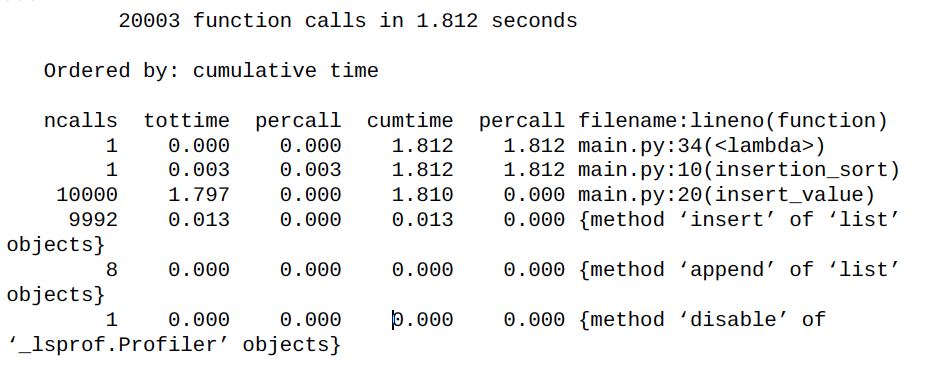
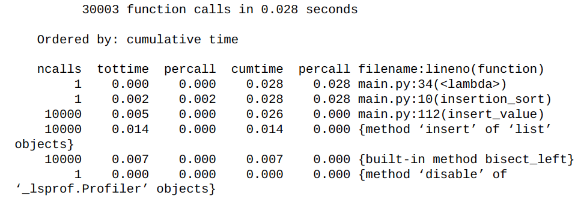
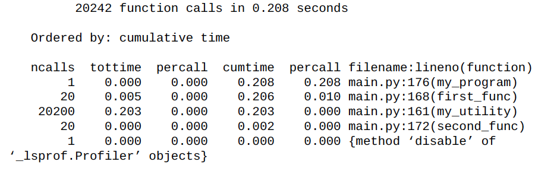
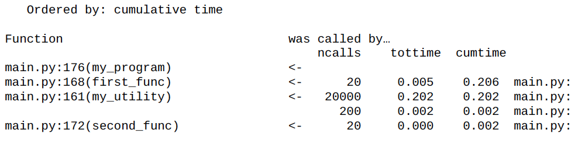

# Effective Python [파이썬 코딩의 기술] - Ch 8 - Production

해당 책은 다음의 링크에서 다운받을 수 있습니다 (영문) : [LINK](https://arisuchan.jp/λ/src/1498628824511-0.pdf)


# Item 54: 배포 환경 구성하는 데 Module-Scoped 코드 고려하기

배포 환경이란, 프로그램이 실행되는 configuration(구성)을 의미한다. 모든 프로그램이 적어도 하나의 배포 환경을 가지고 있다 - product environment. 다만, product environment(환경)의 configuration은 내가 개발하고 있는 개발 환경의 것과 다를 수 있다는 것을 알아야 한다. 

`pyvenv` 같은 툴은 모든 환경들에 같은 Python 패키지가 설치 될 수 있게 한다. 문제가 하나 있다면 그건 바로 product 환경에는 개발 환경에서는 없는 외부적인 요인들이 필요할 때가 있다는 것이다. 예로, 내 프로그램을 웹 서버 컨테이너에 실행을 시키고 DB에 접근이 가능하게 만들고 싶다고 생각해보자. 이는 프로그램 코드를 변경할 때 마다, 서버 컨테이너를 실행해야 하고, DB가 올바르게 작동하고, 접근을 위한 패스워드가 필요하다는 것을 의미한다. 코드에서 줄 하나만 바꾸는데 이 모든 것이 이뤄져야 한다면 비용이 너무 크다.

그래서 가장 좋은 방법은 개발 환경에 따라서 다른 기능들을 제공하는 것이다. 예를 들어, 하나는 production용 하나는 개발용으로 두 개의 \__main__파일을 가질 수 있다.

```python
# dev_main.py
TESTING = True
import db_connection
db = db_connection.Database()

# prod_main.py
TESTING = False
import db_connection
db = db_connection.Database()
```

이 두 파일의 차이점은 `TESTING`이라는 상수의 값이다. 다른 module들이 \__main__파일을 import해서 `TESTING`의 값에 따라서 다르게 작동하게 할 수 있다.

```python
# db_connection.py
import __main__

class TestingDatabase(object):
    # …

class RealDatabase(object):
    # …

if __main__.TESTING:
    Database = TestingDatabase
else:
    Database = RealDatabase
```


여기서 주목해야 할 것은 바로 코드가 module scope(범위)에서 실행되다는 것이다.  이렇게 하면 db 구성과 같은 비용이 드는 과정들을 개발 환경에서 매번 거쳐야할 필요가 없는 것이다.

---

하지만, 개발 환경이 복잡해질수록 `TESTING`과 같은 상수들을 제거하고 `configparser`와 같은 built-in module을 사용하는 것이 낫다. 

---

# Item 55: Output 디버깅 하는 데 repr 문자열 사용하기

주로 Python에서 디버깅을 할 때 `print` 함수를 사용하는 경우가 많다. `print`함수는 사람이 읽기 편하게 모든 객체들이나 문자열들의 값들을 보여줘서 디버깅을 할 때 편하다. 하지만, 이 함수이 문제는 값의 자료형을 정확히 알기 어렵다는 것이다.

밑에 코드처럼, 숫자나 문자 모두 같은 값을 출력한다. 

```python
print(5)
print('5')
# 5
# 5
```

디버깅을 할 때는 값들의 자료형을 구분하는 것도 매우 중요한 일이다. 그렇기 때문에 디버깅을 할 때는 object의 `repr` 버전을 봐야 한다. `repr`는 object를 printable representation으로 리턴하는 buint-in 함수이다. 

```python
a = '\x07'
print(repr(a))

# ‘\x07’
```

`print`로 디버깅할 때 `repr`를 사용해서 자료형을 확실하게 구분할 수 있다. 자료형의 구분을 확실히 해야할 때는 디버깅할 때 `repr` 사용을 고려해야 한다.

```python
print(repr(5))
print(repr('5'))

# 5 
# ‘5’
```

# Item 56: unittest로 모든 것 테스트 하기

Python은 정적 타입 체크를 하지 않는다. 컴파일러는 프로그램을 실행시켰을 때 프로그램이 정상적으로 작동할 것이라는 보장을 해주지 않는다. Python에서는 프로그램이 호출하는 함수가 런타임때 정의될 것인지 알 수가 없다. 이러한 다이나믹함은 좋은 점도 있지만 단점도 있다.

이러한 다이나믹의 장점을 다 사용하고 production으로 배포했을 때 문제를 줄이기 위해서는 **`test`**를 하는 것이 **매우 중요하다.** Test는 코드의 보험과도 같은 존재이다. 리팩토링을 하거나 코드를 확장할 때 test는 어떤 변화가 있었는지 알기 쉽게 만들어준다. 

Test를 가장 쉽게 할 수 있는 방법은 `unittest`라는 built-in module을 사용하는 것이다.

이 코드는 test를 정의하고 있다. 

```python
# utils.py
def to_str(data):
    if isinstance(data, str):
        return data
    elif isinstance(data, bytes):
        return data.decode('utf-8')
    else:
        raise TypeError('Must supply str or bytes, ''found: %r' % data)
```

이제 이 test 코드를 사용하기 위해 다른 코드를 작성해준다. 

```python
# utils_test.py
from unittest import TestCase, main
from utils import to_str

class UtilsTestCase(TestCase):
    def test_to_str_bytes(self):
        self.assertEqual('hello', to_str(b'hello'))

    def test_to_str_str(self):
        self.assertEqual('hello', to_str('hello'))

    def test_to_str_bad(self):
        self.assertRaises(TypeError, to_str, object())

if __name__ == ‘__main__’:
    main()
```

`TestCase` class는 test가 제대로 이뤄졌는지 확인을 하는 helper method들을 제공한다: `asssertEqual`은 결과 값이 같은지 확인을 하고, `assertTrue`는 Boolean 문법을 확인하고, `assertRaises`는 예외사항이 발생했는지 확인을 한다. `TestCase` class에 새로운 helper method를 정의할 수 있다, 다만, method이름이 `test`라는 단어로 시작하지 않으면 된다.


# Item 57: pdb를 이용해 interactive 디버깅 고려하기

Python에서 프로그램의 root 원인을 찾기 힘들 때 built-in *interactive debugger* 사용을 고려해보자. 다른 언어에서 debugger를 사용해서 특정한 구간에서 멈추게 할 수 있다. 이 *interactive debugger*는 그러한 기능을 유저한테 제공한다.이 debugger를 초기화하려면 `pdb`라는 module을 import하고 `set_trace`함수를 실행하면 된다. 매우 간단해서 한 줄이면 함수를 실행시킬 수 있다.

```python
def complex_func(a, b, c):
    # …
    import pdb; pdb.set_trace()
```

해당 구문이 실행될 때 프로그램은 실행을 멈추게 된다. Python 프로그램을 실행했던 터미널은 상호작용이 가능한 Python shell로 변하게 된다.

```python
-> import pdb; pdb.set_trace()
(Pdb)
```

(Pdb) prompt에서 지역 변수의 이름을 작성해서 값들을 print해볼 수 있다. `locals` 라는 built-in 함수로 모든 지역 변수들을 볼 수도 있다. Debugger로 프로그램을 더 쉽게 조사할 수 있는 명령어들로는 다음과 같은 것들이 있다:

- `bt` : 현재 execution call로부터 traceback을 print한다. 즉, 프로그램에서 현재 어디쯔음에 있는지 알 수 있고 어떻게 이 `pdb.set_trace` 포인트까지 오게 됐는지 알 수 있다.
- `up` : 함수 call stack에서 현재 함수의 caller로  scope up 한다.
- `down` : 함수 call stack에서 한 단계 scope back 한다.

분석이 끝났으면 debugger의 다음 명령어들을 사용해서 프로그램 실행을 재개할 수 있다:

- `step` : 프로그램을 다음 라인까지 실행시키고 debugger가 다시 통제할 수 있게 해준다. 만약 다음 라인이 함수를 부르는 부분이면, debugger는 호출된 함수에서 멈춘다.
- `next` : 현재 함수에서 다음 라인까지 프로그램을 실행시키고 debugger가 다시 통제할 수 있게 해준다. 다음 라인이 함수를 부르는 부분이면 호출된 함수가 리턴되기 전까지는 멈추지 않는다.
- `return` : 현재 함수가 리턴할 때 까지 프로그램을 실행시키고 나서 통제권을 다시 debugger에게 준다.
- `continue` : 그 다음 breakpoint까지(혹은 set_trace가 다시 호출됐을 때) 프로그램을 실행시킨다.

# Item 58: 최적화하기전에 Profile하기

Python은 다이나믹하기 때문에 런타임 때 어떤 부분들은 예측했던 것보다 느릴 수도 있고 빠를 수도 있다. 최적화하기 전에는 코드의 어떤 부분들이 성능을 저하하는지 알면 좋다. Python은 `profiler`을 제공하는데, 이는 execution time에 responsible하다. 어디가 느린지 알면, 최적화를 할 때 코드의 언느 부분을 신경써서 수정을 해야하는지 알 수 있기 때문에 매우 도움이 된다.

어떤 알고리즘이 있고 왜 느린지 알아보려고 한다. 밑에는 list의 데이터들을 정렬하는 함수인데 의도적으로 매우 비효율적으로 만들었다. 알고리즘은 input array에 대해서 linear하게 스캔을 한다. 

```python
def insertion_sort(data):
    result = []
    for value in data:
        insert_value(result, value)
    return result

def insert_value(array, value):
    for i, existing in enumerate(array):
        if existing > value:
            array.insert(i, value)
            return
    array.append(value)
```

`insertion_sort`와 `insert_value`를 profile하기 위해 랜덤한 숫자들의 set을 만들고 `test`함수를 만들어서 profiler에 전달을 했다.

```python
from random import randint

max_size = 10**4
data = [randint(0, max_size) for _ in range(max_size)]
test = lambda: insertion_sort(data)
```

Python은 2개의 built-in `profilers`를 제공하는데, 하나는 순수한 Python (profile)이고 다른 하나는 C-extension module (`cProfile`)이다. `cProfile`은 profile하면서 프로그램 성능에 매우 적은 영향일 끼치기 때문에 더 낫다. 순수 Python profile은 오버헤드가 커서 결과가 왜곡될 수 있다.

이제 Profile object를 `cProfile` module로부터 초기화하고  `runcall` method를 사용해서 test 함수를 실행한다.

```python
profiler = Profile()
profiler.runcall(test)
```

 

Test 함수 실행이 끝나면, 성능에 대한 통계를 `pstats` module의 `Stats` class로 수집할 수 있다.

```python

stats = Stats(profiler)
stats.strip_dirs()
stats.sort_stats(‘cumulative’)
stats.print_stats()

```

출력 결과는 table이다. 데이터 샘플은 profiler가 활성화 돼있을 때, `runcall` method가 실행 됐을 때 수집되었다.




각 profiler statistics의 행들이 의미하는 바는 다음과 같다:

- `ncalls` : profiling 기간도안 함수가 호출된 횟수
- `tottime` : 함수 자체가 실행되는데 걸린 시간, 다른 함수 호출한 시간은 제외됨
- `tottime percall` : 함수가 호출될 때 걸린 평균 시간, 마찬가지로 다른 함수 호출한 시간 제외. 이 행은 `tottime` 을 `ncalls`로 나눈 값이다
- `cumtime` : 누적으로 함수가 실행되는데 걸린 시간, 다른 함수 호출 시간은 제외됨
- `cumtime percall` : 이 행은 `cumtime` 을 `ncalls`로 나눈 값이다

위 profiler statistics를 보면 `insert_value` 함수에서 누적으로 걸린 시간이 제일 오래 걸렸음을 알 수 있다. 그래서 해당 함수를 `bisect` module을 사용해서 재정의 한다.

```python

from bisect import bisect_left

def insert_value(array, value):
    i = bisect_left(array, value)
    array.insert(i, value)

```


다시 profiler를 실행하면, 누적 시간이 이전보다 100배 빨라진 것을 볼 수 있다.



### 주의해야할 점

가끔 프로그램을 profile하다보면 자주 사용하는 함수는 execution 시간을 많이 잡아먹는다고 나온다. 하지만, 그렇다고 해당 함수의 알고리즘이 비효율적이어서 execution 시간이 높게 나온 것은 아니다. 

my_utility 함수는 두개의 다른 함수에 의해서 호출이 많이 되었다.


```python
def my_utility(a, b):
    # …

def first_func():
    for _ in range(1000):
        my_utility(4, 5)

def second_func():
    for _ in range(10):
        my_utility(1, 3)

def my_program():
    for _ in range(20):
        first_func()
        second_func()

```


해당 함수를 profile해보면 헷갈리는 상황이 생긴다. 프로그램 내에서 my_utility 함수는 가장 많은 execution 시간을 잡아먹었다. 하지만, 왜 이 함수가 그렇게 많이 호출되었는지 알기는 어렵다. 




이러한 문제를 해결하기 위해서 `stats.print_callers()` 가 있다. 실행을 하면 table을 보여주는데, 왼쪽은 호출된 함수를 나타내고 오른쪽에는 이 함수를 누가 호출했는지 알려준다. 이제는 my_utility가 first_func에 의해 가장 많이 사용되었음을 알 수 있게 된다.





# Item 59: tracemalloc으로 메모리 사용 현황과 Leaks 파악하기

Python에서 메모리 관리는 기본적으로 구현이 되어있다. 그래서 object의 referece(참조)가 끝나는 순간 해당 object가 메모리에서 제거 되게 되어있다. 이론적으로 Python 프로그래머는 메모리를 할당 혹은 해제에 대해 신경을 쓰지 않아도 된다. 하지만, 실제로 프로그래밍하다보면 referece 때문에 메모리가 꽉 차는 상황이 생긴다. 프로그램 어디에서 메모리가 leak되는지 파악하는 것은 어려운 일이다.

메모리 사용 현황을 디버깅하는 하나의 방법은 `gc` module로 garbace collector가 감지한 모든 object를 보여주는 것이다. 밑에 코드에서 reference를 제거하지 않고 메모리를 낭비하도록 구현했다. 

```python
# using_gc.py
import gc

found_objects = gc.get_objects()
print(‘%d objects before’ % len(found_objects))

import waste_memoryx = waste_memory.run()
found_objects = gc.get_objects()
print(‘%d objects after’ % len(found_objects))
for obj in found_objects[:3]:
    print(repr(obj)[:100])

# 4756 objects before
# 14873 objects after
# <waste_memory.MyObject object at 0x1063f6940>
# <waste_memory.MyObject object at 0x1063f6978>
# <waste_memory.MyObject object at 0x1063f69b0>
```


`gc.get_objects`의 문제점은 object들이 `어떻게` 할당됐는지 알려주지 않는다는 것이다. 복잡한 프로그램에서 특정한 class의 object가 여러 다른 방법으로 할당 될 수 있다. 

Python 3.4부터 이러한 문제를 해결하기 위해 `tracemalloc` module을 선보였다. `tracemalloc`은 object가 어디에서 할당되었는지 추적할 수 있다.

```python
import tracemalloc

tracemalloc.start(10) # Save up to 10 stack frames
time1 = tracemalloc.take_snapshot()

import waste_memoryx = waste_memory.run()
time2 = tracemalloc.take_snapshot()
stats = time2.compare_to(time1, ‘lineno’)
for stat in stats[:3]:
    print(stat)


# waste_memory.py:6: size=2235 KiB (+2235 KiB), count=29981 (+29981),average=76 B
# waste_memory.py:7: size=869 KiB (+869 KiB), count=10000 (+10000), average=89B 
# waste_memory.py:12: size=547 KiB (+547 KiB), count=10000 (+10000), average=56B
```

출력 결과를 보면 어떤 object가 메모리를 차지하고 있는지 알기 싶고, 소스 코드 어디에서 할당됐는지 알 수 있다.